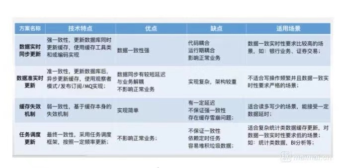

### 1.redis为什么可以达到单机10万QPS,为什么这么快

- 单线程（避免了线程竞争）
- 内存数据库
- epoll 网络模型
- 多种高效率的数据结构
-----
### 2. zk和redis都可以实现分布式锁，为什么常用redis而不是zk

- zk 性能低，属于（CP模式）；redis 高性能，属于（AP模式）

- 分布式锁并不绝对可靠（锁失效），虽然最大程度挡住了并发请求；共享资源还是要做好兜底。

#### zk的优点

- 不需要考虑锁的过期时间
- watch机制，加锁失败，可以watch等待锁释放，实现乐观锁

#### redis实现分分布式锁会遇到什么问题,以及如何解决

- `死锁`：设置过期时间
- `过期时间不好评估，锁提前过期`：设置守护线程，自动续期（redisson sdk "看门狗"线程）
- `锁被别人释放`：锁写入唯一标识，释放锁线检查标识，再释放（LUA搅拌）

#### 什么是redLock,解决了什么问题

- redis主从集群部署+哨兵部署，当主从切换时，主从复制延迟导致锁失效问题

- 不再需要部署从库和哨兵实例，`只部署主库`,官方推荐部署至少5个实例

#### redLock加锁流程

- 客户端先获取当前时间戳 T1
- 客户端依次向5个redis实例发起加锁请求（set命令），且每个请求会设置超时时间（远小于锁的有效时间），如果某个实例加锁失败，立即向下一个redis实例申请加锁
- 如果客户端从》=3个（大多数）以上redis实例加锁成功，则再次获取当前时间戳T2,如果T2-T1<锁的过期时间，此时，认为客户端加锁成功，否则认为加锁失败
- 加锁成功，去操作共享资源
- 加锁失败，向"全部节点"发起释放锁请求「LUA脚本释放锁」

### 如何保证缓存一致（性能、一致性、实时性）

### B+ 树和 skipList 的时间复杂度都是log(n),为什么数据库底层要用B+树而不用 skipList

- 跳跃表是通过二路分治的方式实现LogN;B+Tree 是通过多路分治的方式实现LogN;
- B+树的跟节点到任何一个叶子节点的路径是固定的；而skipList的头节点到目标节点的路径是不固定的。检索的value越大，skipList的路径就越深，磁盘的io次数就越多
- B+tree叶子节点构成了一个双向循环链表，每一块叶子节点可以存储一条或者多条数据，这种结构不管是一条记录，还是多条记录都能节省磁盘IO；skiplist每一个节点只存储一条记录，对于一条记录的查询是比较节省磁盘IO，对于多条记录的查询，skipList的查询IO次数会比B+tree要多
- B+树的查询效率更稳定