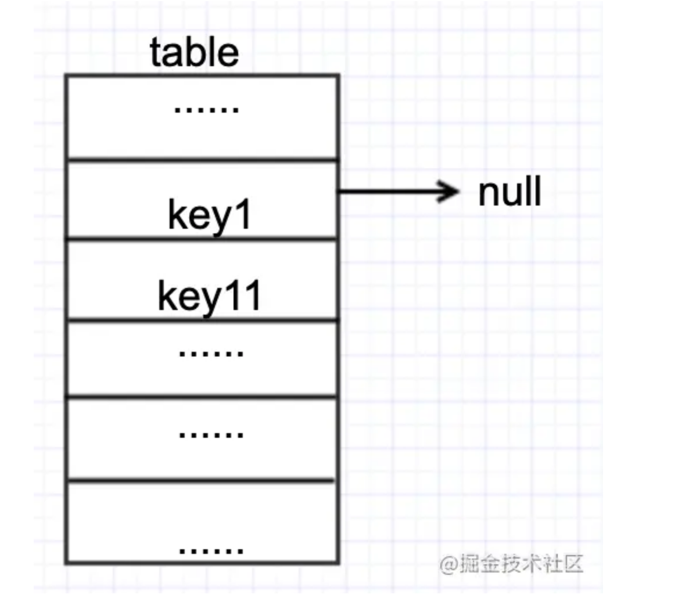
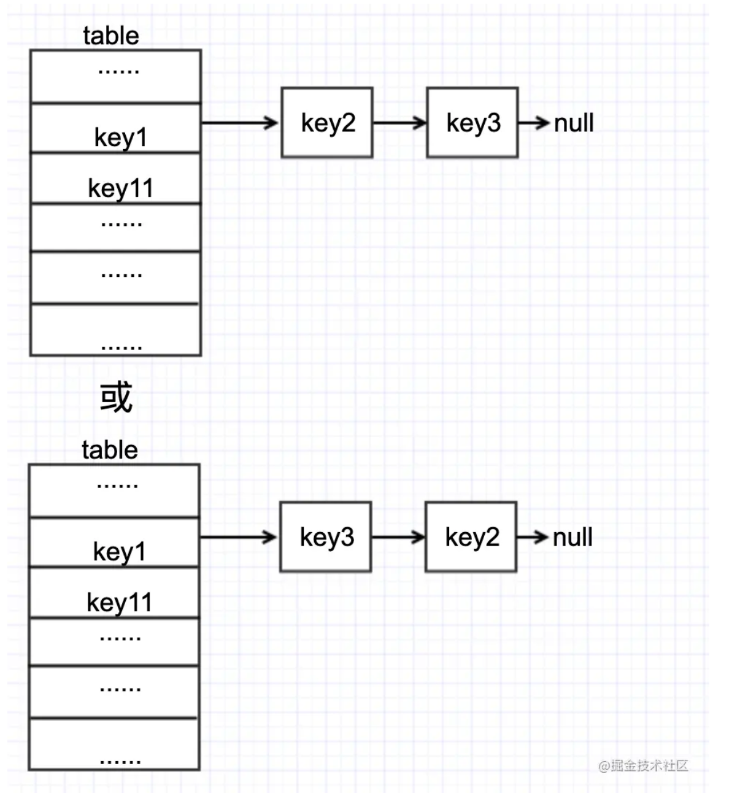
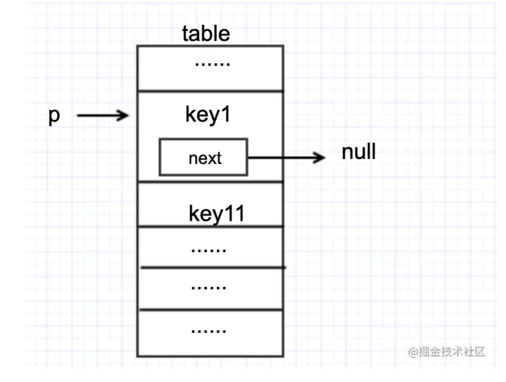
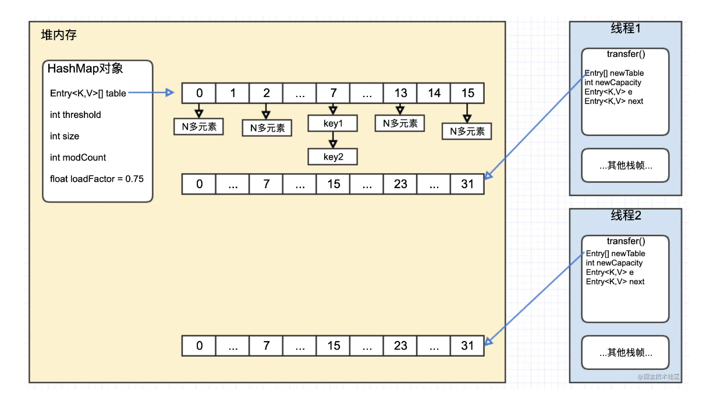
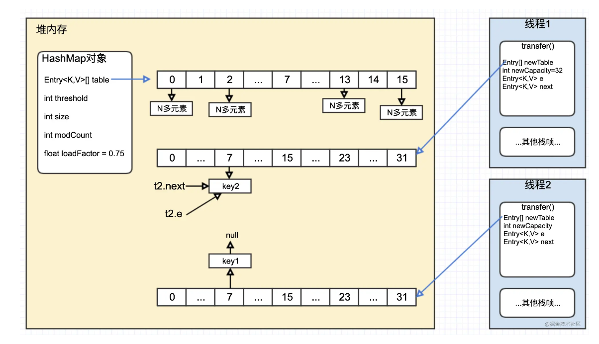
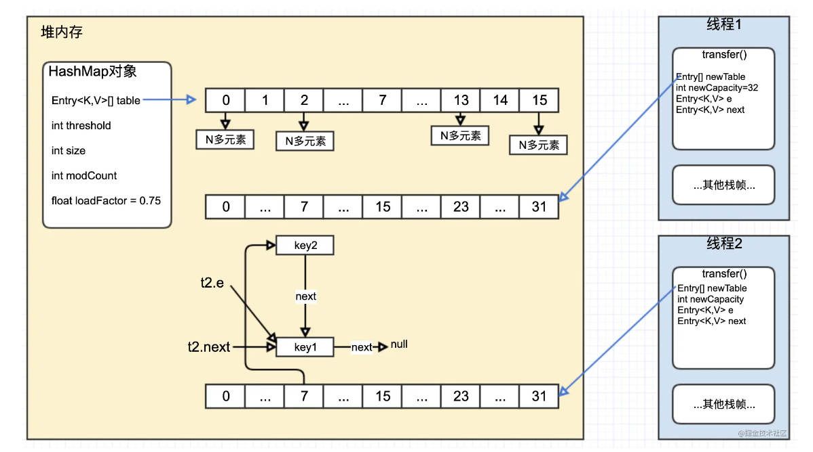
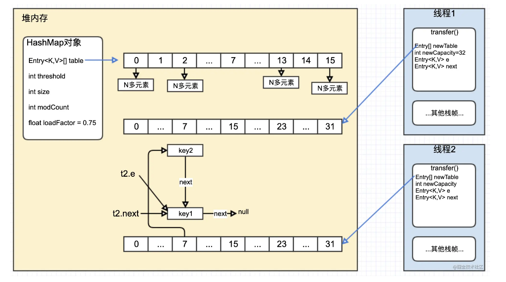
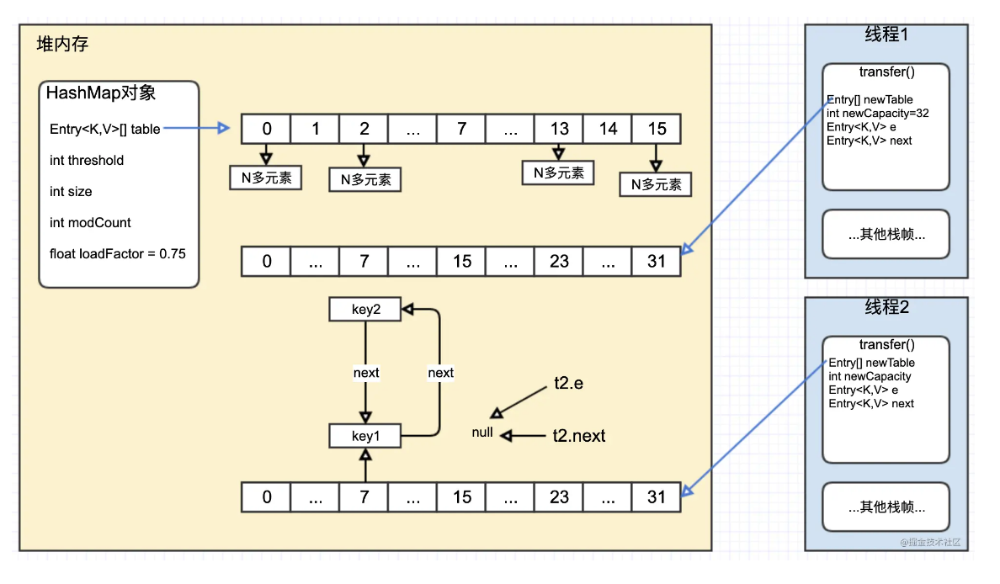

### 深入解读HashMap线程安全性问题

- HashMap是线程不安全的，在多线程环境下对某个对象中HashMap类型的实例变量进行操作时，可能会产生各种不符合预期的问题。


- 注：以下基于JDK1.8

### 多线程的put可能导致元素的丢失

###1.1试验代码如下
- 注：仅作为可能会产生这个问题的样例代码，直接运行不一定会产生问题

````java
public class ConcurrentIssueDemo1 {

    private static Map<String, String> map = new HashMap<>();

    public static void main(String[] args) {
        // 线程1 => t1
        new Thread(new Runnable() {
            @Override
            public void run() {
                for (int i = 0; i < 99999999; i++) {
                    map.put("thread1_key" + i, "thread1_value" + i);
                }
            }
        }).start();
        // 线程2 => t2
        new Thread(new Runnable() {
            @Override
            public void run() {
                for (int i = 0; i < 99999999; i++) {
                    map.put("thread2_key" + i, "thread2_value" + i);
                }
            }
        }).start();
    }
}

````
###1.2 触发此问题的场景
先来看一下put方法的源码

````java
public V put(K key, V value) {
    return putVal(hash(key), key, value, false, true);
}

final V putVal(int hash, K key, V value, boolean onlyIfAbsent,
               boolean evict) {
    Node<K,V>[] tab; Node<K,V> p; int n, I;
    // 初始化hash表
    if ((tab = table) == null || (n = tab.length) == 0)
        n = (tab = resize()).length;
    // 通过hash值计算在hash表中的位置，并将这个位置上的元素赋值给p，如果是空的则new一个新的node放在这个位置上
    if ((p = tab[i = (n - 1) & hash]) == null)
        tab[i] = newNode(hash, key, value, null);
    else {
        // hash表的当前index已经存在元素，向这个元素后追加链表
        Node<K,V> e; K k;
        if (p.hash == hash &&
            ((k = p.key) == key || (key != null && key.equals(k))))
            e = p;
        else if (p instanceof TreeNode)
            e = ((TreeNode<K,V>)p).putTreeVal(this, tab, hash, key, value);
        else {
            for (int binCount = 0; ; ++binCount) {
                // 新建节点并追加到链表
                if ((e = p.next) == null) { // #1
                    p.next = newNode(hash, key, value, null); // #2
                    if (binCount >= TREEIFY_THRESHOLD - 1) // -1 for 1st
                        treeifyBin(tab, hash);
                    break;
                }
                if (e.hash == hash &&
                    ((k = e.key) == key || (key != null && key.equals(k))))
                    break;
                p = e;
            }
        }
        if (e != null) { // existing mapping for key
            V oldValue = e.value;
            if (!onlyIfAbsent || oldValue == null)
                e.value = value;
            afterNodeAccess(e);
            return oldValue;
        }
    }
    ++modCount;
    if (++size > threshold)
        resize();
    afterNodeInsertion(evict);
    return null;
}

````
- 假设当前HashMap中的table状态如下：



- 此时t1和t2同时执行put，假设t1执行put(“key2”, “value2”)，t2执行put(“key3”, “value3”)，并且key2和key3的hash值与图中的key1相同。

- 那么正常情况下，put完成后，table的状态应该是下图二者其一
  


## 下面来看看异常情况

### 多线程的put可能导致元素丢失

- 假设线程1、线程2现在都执行到put源代码中#1的位置(**也就是新建节点并追加到链表**)，且当前table状态如下



- 然后两个线程都执行了if ((e = p.next) == null)这句代码，来到了#2这行代码(也就是并发在桶节点添加节点)。

- 此时假设t1先执行p.next = newNode(hash, key, value, null);

那么table会变成如下状态


- 紧接着t2执行p.next = newNode(hash, key, value, null);

此时table会变成如下状态


这样一来，key2元素就丢了。

### put和get并发时，可能导致get为null

#### 场景:线程1执行put时，因为元素个数超出threshold而导致rehash，线程2此时执行get，有可能导致这个问题。

__先看下resize方法源码__

- 大致意思是，先计算新的容量和threshold，在创建一个新hash表，最后将旧hash表中元素rehash到新的hash表中

- 重点代码在于#1和#2两句(**也就是构建新table,同时新table赋值给旧table**)
````java
// hash表
transient Node<K,V>[] table;

final Node<K,V>[] resize() {
    // 计算新hash表容量大小，begin
    Node<K,V>[] oldTab = table;
    int oldCap = (oldTab == null) ? 0 : oldTab.length;
    int oldThr = threshold;
    int newCap, newThr = 0;
    if (oldCap > 0) {
        if (oldCap >= MAXIMUM_CAPACITY) {
            threshold = Integer.MAX_VALUE;
            return oldTab;
        }
        else if ((newCap = oldCap << 1) < MAXIMUM_CAPACITY &&
                 oldCap >= DEFAULT_INITIAL_CAPACITY)
            newThr = oldThr << 1; // double threshold
    }
    else if (oldThr > 0) // initial capacity was placed in threshold
        newCap = oldThr;
    else {               // zero initial threshold signifies using defaults
        newCap = DEFAULT_INITIAL_CAPACITY;
        newThr = (int)(DEFAULT_LOAD_FACTOR * DEFAULT_INITIAL_CAPACITY);
    }
    if (newThr == 0) {
        float ft = (float)newCap * loadFactor;
        newThr = (newCap < MAXIMUM_CAPACITY && ft < (float)MAXIMUM_CAPACITY ?
                  (int)ft : Integer.MAX_VALUE);
    }
    threshold = newThr;
    // 计算新hash表容量大小，end

    @SuppressWarnings({"rawtypes","unchecked”})
    Node<K,V>[] newTab = (Node<K,V>[])new Node[newCap]; // #1
    table = newTab; // #2
    // rehash begin
    if (oldTab != null) {
        for (int j = 0; j < oldCap; ++j) {
            Node<K,V> e;
            if ((e = oldTab[j]) != null) {
                oldTab[j] = null;
                if (e.next == null)
                    newTab[e.hash & (newCap - 1)] = e;
                else if (e instanceof TreeNode)
                    ((TreeNode<K,V>)e).split(this, newTab, j, oldCap);
                else { // preserve order
                    Node<K,V> loHead = null, loTail = null;
                    Node<K,V> hiHead = null, hiTail = null;
                    Node<K,V> next;
                    do {
                        next = e.next;
                        if ((e.hash & oldCap) == 0) {
                            if (loTail == null)
                                loHead = e;
                            else
                                loTail.next = e;
                            loTail = e;
                        }
                        else {
                            if (hiTail == null)
                                hiHead = e;
                            else
                                hiTail.next = e;
                            hiTail = e;
                        }
                    } while ((e = next) != null);
                    if (loTail != null) {
                        loTail.next = null;
                        newTab[j] = loHead;
                    }
                    if (hiTail != null) {
                        hiTail.next = null;
                        newTab[j + oldCap] = hiHead;
                    }
                }
            }
        }
    }
    // rehash end
    return newTab;
}

````
- 在代码#1位置，用新计算的容量new了一个新的hash表，#2将新创建的空hash表赋值给实例变量table。

- **注意此时实例变量table是空的。**

- 那么，如果此时另一个线程执行get时，就会get出null。

----
###JDK7中HashMap并发put会造成循环链表，导致get时出现死循环此问题在JDK8中已经解决。

### 3.1 JDK7中循环链表的形成

#### 发生在多线程并发resize的情况下。


- 相关源码如下：

````java
void resize(int newCapacity) {
    Entry[] oldTable = table;
    int oldCapacity = oldTable.length;
    if (oldCapacity == MAXIMUM_CAPACITY) {
        threshold = Integer.MAX_VALUE;
        return;
    }

    Entry[] newTable = new Entry[newCapacity];
    transfer(newTable, initHashSeedAsNeeded(newCapacity));
    table = newTable;
    threshold = (int)Math.min(newCapacity * loadFactor, MAXIMUM_CAPACITY + 1);
}

/**
 * Transfers all entries from current table to newTable.
 */
// 关键在于这个transfer方法，这个方法的作用是将旧hash表中的元素rehash到新的hash表中
void transfer(Entry[] newTable, boolean rehash) {
    int newCapacity = newTable.length;
    for (Entry<K,V> e : table) { // table变量即为旧hash表
        while(null != e) {
            // #1
            Entry<K,V> next = e.next;
            if (rehash) {
                e.hash = null == e.key ? 0 : hash(e.key);
            }
            // 用元素的hash值计算出这个元素在新hash表中的位置
            int i = indexFor(e.hash, newCapacity);
            // #2
            e.next = newTable[I];
            // #3
            newTable[i] = e;
            // #4
            e = next;
        }
    }
}

````

- 假设线程1(t1)和线程2(t2)同时resize，两个线程resize前，两个线程及hashmap的状态如下



- 堆内存中的HashMap对象中的table字段指向旧的hash表，其中index为7的位置有两个元素，我们以这两个元素的rehash为例，看看循环链表是如何形成的。

- 线程1和线程2分别new了一个hash表，用newTable字段表示。

- Step1: t2执行完#1代码后，CPU且走执行t1，并且t1执行完成

这里可以根据上图推算一下，此时状态如下



- 用t2.e表示线程2中的局部变量e，t2.next同理。

- Step2: t2继续向下执行完本次循环



Step3: t2继续执行下一次循环


Step4: t2继续下一次循环，循环链表出现



### 3.2 死循环的出现

- HashMap.get方法源码如下：

````java
public V get(Object key) {
    if (key == null)
        return getForNullKey();
    Entry<K,V> entry = getEntry(key);

    return null == entry ? null : entry.getValue();
}

final Entry<K,V> getEntry(Object key) {
    if (size == 0) {
        return null;
    }

    int hash = (key == null) ? 0 : hash(key);
    // 遍历链表
    for (Entry<K,V> e = table[indexFor(hash, table.length)];
         e != null;
         e = e.next) {
        Object k;
        // 假设这里条件一直不成立
        if (e.hash == hash &&
            ((k = e.key) == key || (key != null && key.equals(k))))
            return e;
    }
    return null;
}

````
由上图可知，for循环中的e = e.next永远不会为空，那么，如果get一个在这个链表中不存在的key时，就会出现死循环了。