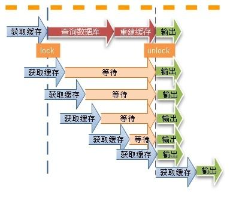

### 缓存一致性解决方案


### 缓存使用类型

### 只读缓存

- 应用要读取数据的话，会先调用 Redis GET 接口，查询数据是否存在。而所有的数据写请求，会直接发往后端的数据库，在数据库中增删改
- 对于删改的数据来说，如果 Redis 已经缓存了相应的数据，应用需要把这些缓存的数据删除，Redis 中就没有这些数据了。
- 只读缓存直接在数据库中更新数据的好处是，所有最新的数据都在数据库中，而数据库是提供数据可靠性保障的，这些数据不会有丢失的风险

### 读写缓存

- 对于读写缓存来说，除了读请求会发送到缓存进行处理（直接在缓存中查询数据是否存在)，所有的写请求也会发送到缓存，在缓存中直接对数据进行增删改操作

- 根据业务应用对数据可靠性和缓存性能的不同要求,我们会有**同步直写**和**异步写回**两种策略;同步直写策略优先保证数据可靠性,而异步写回策略优先提供快速响应

#### 同步直写

- 同步直写是指,写请求发给缓存的同时,也会发给后端数据库进行处理,等到缓存和数据库都写完数据,才给客户端返回

#### 异步写回

- 所有写请求都先在缓存中处理。等到这些增改的数据要被从缓存中淘汰出来时，缓存将它们写回后端数据库。这样一来，处理这些数据的操作是在缓存中进行的，很快就能完成。只不过，如果发生了掉电，而它们还没有被写回数据库，就会有丢失的风险了。

------

### Redis只读缓存和使用同步直写策略的读写缓存,这两种缓存都会把数据同步写到后端数据库中,它们的区别在于：

- 使用只读缓存时，是先把修改写到后端数据库中，再把缓存中的数据删除。当下次访问这个数据时，会以后端数据库中的值为准，重新加载到缓存中。这样做的优点是，数据库和缓存可以保证完全一致，并且缓存中永远保留的是经常访问的热点数据。缺点是每次修改操作都会把缓存中的数据删除，之后访问时都会先触发一次缓存缺失，然后从后端数据库加载数据到缓存中,这个过程访问延迟会变大。

- 使用读写缓存时，是同时修改数据库和缓存中的值。这样做的优点是，被修改后的数据永远在缓存中存在，下次访问时，能够直接命中缓存，不用再从后端数据库中查询，这个过程拥有比较好的性能，比较适合先修改又立即访问的业务场景。但缺点是在高并发场景下，如果存在多个操作同时修改同一个值的情况，可能会导致缓存和数据库的不一致。

- 当使用只读缓存时，如果修改数据库失败了，那么缓存中的数据也不会被删除，此时数据库和缓存中的数据依旧保持一致。而使用读写缓存时，如果是先修改缓存，后修改数据库，如果缓存修改成功，而数据库修改失败了，那么此时数据库和缓存数据就不一致了。如果先修改数据库，再修改缓存，也会产生上面所说的并发场景下的不一致。

----

## 三个经典缓存模式

### 旁路缓存(Cache-Aside Pattern)

- 如果应用程序想要使用 Redis 缓存，我们就要在程序中增加相应的缓存操作代码。所以，我们也把 Redis 称为旁路缓存，也就是说，读取缓存、读取数据库和更新缓存的操作都需要在应用程序中来完成

- 它的提出是为了尽可能地解决缓存与数据库的数据不一致问题。

#### 旁路缓存-读流程


- 读的时候，先读缓存，缓存命中的话，直接返回数据

- 缓存没有命中的话，就去读数据库，从数据库取出数据，放入缓存后，同时返回响应

#### 旁路缓存-写流程


- 更新的时候，先更新数据库，然后再删除缓存。

---- 

### Read-through/write-through(读写穿透)

- Read/Write-Through模式中，服务端把缓存作为主要数据存储。应用程序跟数据库缓存交互，都是通过抽象缓存层完成的。

#### Read-Through


Read-Through和Cache-Aside很相似，不同点在于程序不需要再去管理从哪去读数据（缓存还是数据库）。相反它会直接从缓存中读数据，该场景下是缓存去决定从哪查询数据。当我们比较两者的时候这是一个优势因为它会让程序代码变得更简洁。

#### Write-Through


Write-Through下所有的写操作都经过缓存，每次我们向缓存中写数据的时候，缓存会把数据持久化到对应的数据库中去，且这两个操作都在一个事务中完成。因此，只有两次都写成功了才是最终写成功了。这的确带来了一些写延迟但是它保证了数据一致性。

同时，因为程序只和缓存交互，编码会变得更加简单和整洁，当你需要在多处复用相同逻辑的时候这点变的格外明显。

-----

### Write-behind （异步缓存写入）

- Read/Write-Through是同步更新缓存和数据的，Write-Behind则是只更新缓存，不直接更新数据库，通过批量异步的方式来更新数据库


- 缓存和数据库的一致性不强，对一致性要求高的系统要谨慎使用。但是它适合频繁写的场景，MySQL的InnoDB Buffer Pool机制就使用到这种模式

---------

### 常见问题

#### 1. 数据在删改操作时，如果不是删除缓存值，而是直接更新缓存的值，你觉得和删除缓存值相比，有什么好处和不足？

这种情况相当于把Redis当做读写缓存使用，删改操作同时操作数据库和缓存,分两种情况来分析，如下：

- `先更新数据库，再更新缓存`：如果更新数据库成功，但缓存更新失败，此时数据库中是最新值，但缓存中是旧值，后续的读请求会直接命中缓存，得到的是旧值。

- `先更新缓存，再更新数据库`
  ：如果更新缓存成功，但数据库更新失败，此时缓存中是最新值，数据库中是旧值，后续读请求会直接命中缓存，但得到的是最新值，短期对业务影响不大。但是，一旦缓存过期或者满容后被淘汰，读请求就会从数据库中重新加载旧值到缓存中，之后的读请求会从缓存中得到旧值，对业务产生影响。

- 同样地，针对这种其中一个操作可能失败的情况，也可以使用重试机制解决，把第二步操作放入到消息队列中，消费者从消息队列取出消息，再更新缓存或数据库，成功后把消息从消息队列删除，否则进行重试，以此达到数据库和缓存的最终一致。

以上是没有并发请求的情况。如果存在并发读写，也会产生不一致，分为以下4种场景。

- 场景1：`先更新数据库，再更新缓存`，`写+读并发`
  ：线程A先更新数据库，之后线程B读取数据，此时线程B会命中缓存，读取到旧值，之后线程A更新缓存成功，后续的读请求会命中缓存得到最新值。这种场景下，线程A未更新完缓存之前，在这期间的读请求会短暂读到旧值，对业务短暂影响。

- 场景2：`先更新缓存，再更新数据库`，`写+读并发`
  ：线程A先更新缓存成功，之后线程B读取数据，此时线程B命中缓存，读取到最新值后返回，之后线程A更新数据库成功。这种场景下，虽然线程A还未更新完数据库，数据库会与缓存存在短暂不一致，但在这之前进来的读请求都能直接命中缓存，获取到最新值，所以对业务没影响。

- 场景3：`先更新数据库，再更新缓存`，`写+写并发`：线程A和线程B同时更新同一条数据，更新数据库的顺序是先A后B，但更新缓存时顺序是先B后A，这会导致数据库和缓存的不一致。

- 场景4：`先更新缓存，再更新数据库`，`写+写并发`：与场景上面类似，线程A和线程B同时更新同一条数据，更新缓存的顺序是先A后B，但是更新数据库的顺序是先B后A，这也会导致数据库和缓存的不一致。

场景1和2对业务影响较小，场景3和4会造成数据库和缓存不一致，影响较大。也就是说，在读写缓存模式下，写+读并发对业务的影响较小，而写+写并发时，会造成数据库和缓存的不一致。

针对场景3和4的解决方案是，对于写请求，需要配合**分布式锁**使用。写请求进来时，针对同一个资源的修改操作，先加分布式锁，这样同一时间只允许一个线程去更新数据库和缓存，没有拿到锁的线程把操作放入到队列中，延时处理。用这种方式保证多个线程操作同一资源的顺序性，以此保证一致性。

综上，使用读写缓存同时操作数据库和缓存时，因为其中一个操作失败导致不一致的问题，同样可以通过消息队列重试来解决。而在并发的场景下，读+写并发对业务没有影响或者影响较小，而写+写并发时需要配合分布式锁的使用，才能保证缓存和数据库的一致性。

另外，读写缓存模式由于会同时更新数据库和缓存：

- **优点是**:缓存中一直会有数据，如果更新操作后会立即再次访问，可以直接命中缓存，能够降低读请求对于数据库的压力（没有了只读缓存的删除缓存导致缓存缺失和再加载的过程）。
  
- **缺点是**:如果更新后的数据，之后很少再被访问到，会导致缓存中保留的不是最热的数据，缓存利用率不高（只读缓存中保留的都是热数据），所以读写缓存比较适合用于读写相当的业务场景。

-------------

### 操作缓存的时候，到底是删除缓存呢，还是更新缓存？

- 先操纵数据库而不是先操作缓存
- 删缓存而不是修改缓存

#### Cache-Aside 在写入请求的时候，为什么是删除缓存而不是更新缓存呢？


- 线程A先发起一个写操作，第一步先更新数据库
- 线程B再发起一个写操作，第二步更新了数据库
- 由于网络等原因，线程B先更新了缓存
- 线程A更新缓存。

这时候，缓存保存的是A的数据（老数据），数据库保存的是B的数据（新数据），数据不一致了，脏数据出现啦。如果是删除缓存取代更新缓存则不会出现这个脏数据问题。

#### 双写的情况下，先操作数据库还是先操作缓存？


- 线程A发起一个写操作，第一步del cache
- 此时线程B发起一个读操作，cache miss
- 线程B继续读DB，读出来一个老数据
- 然后线程B把老数据设置入cache
- 线程A写入DB最新的数据

缓存和数据库的数据不一致了。缓存保存的是老数据，数据库保存的是新数据。因此，Cache-Aside缓存模式，**选择了先操作数据库而不是先操作缓存**。

### 数据库和缓存数据保持强一致？

- 实际上，没办法做到数据库与缓存绝对的一致性。 这是由CAP理论决定的。缓存系统适用的场景就是非强一致性的场景，它属于CAP中的AP。个人觉得，追求绝对一致性的业务场景，不适合引入缓存。
- CAP理论，指的是在一个分布式系统中， Consistency（一致性）、 Availability（可用性）、Partition tolerance（分区容错性），三者不可得兼。 但是，通过一些方案优化处理，是可以保证弱一致性，最终一致性的

------

### 3种方案保证数据库与缓存的一致性

#### 缓存延时双删


- 先删除缓存
- 再更新数据库
- 休眠一会（比如1秒），再次删除缓存。

- 这个休眠时间 = 读业务逻辑数据的耗时 + 几百毫秒。为了确保读请求结束，写请求可以删除读请求可能带来的缓存脏数据。

这种方案还算可以，只有休眠那一会（比如就那1秒），可能有脏数据，一般业务也会接受的。但是如果第二次删除缓存失败呢？缓存和数据库的数据还是可能不一致，对吧？
给Key设置一个自然的expire过期时间，让它自动过期怎样？那业务要接受过期时间内，数据的不一致咯？还是有其他更佳方案呢？

#### 删除缓存重试机制

- 不管是**延时双删**还是**Cache-Aside的先操作数据库再删除缓存**，都可能会存在第二步的删除缓存失败，导致的数据不一致问题。可以使用这个方案优化：删除失败就多删除几次呀,保证删除缓存成功就可以了呀，所以可以引入`删除缓存重试机制`


- 写请求更新数据库
- 缓存因为某些原因，删除失败
- 把删除失败的key放到消息队列
- 消费消息队列的消息，获取要删除的key
- 重试删除缓存操作

#### 读取binlog异步删除缓存

- 重试删除缓存机制,会造成好多业务代码入侵。其实，还可以这样优化：`通过数据库的binlog来异步淘汰key`。


- 可以使用阿里的canal将binlog日志采集发送到MQ队列里面然后通过ACK机制确认处理这条更新消息，删除缓存，保证数据缓存一致性

--------------

## 常见缓存问题


### 缓存雪崩

### 第一个原因:

缓存中有大量数据同时过期，导致大量请求无法得到处理 ;

#### 解决方案一: **设置过期时间加一个随机时长**

#### 解决方案二: 服务降级

- 当业务应用访问的是非核心数据（例如电商商品属性）时，暂时停止从缓存中查询这些数据，而是直接返回预定义信息、空值或是错误信息

- 当业务应用访问的是核心数据（例如电商商品库存）时，仍然允许查询缓存，如果缓存缺失，也可以继续通过数据库读取。

### 第二个原因:

redis实例宕机引起的雪崩

#### 解决方案一: 在业务系统中实现服务熔断或请求限流机制

#### 解决方案二: 通过主从节点的方式构建 Redis 缓存高可靠集群

----
### 缓存击穿

- 缓存击穿是指，针对某个访问非常频繁的热点数据的请求，无法在缓存中进行处理，紧接着，访问该数据的大量请求，一下子都发送到了后端数据库，导致了数据库压力激增，会影响数据库处理其他请求。
  
- 缓存击穿的情况，经常发生在热点数据过期失效时

#### 解决方案一: 通过不设置缓存过期时间来避免缓存击穿

-----

### 缓存穿透

- 缓存穿透是指要访问的数据既不在 Redis 缓存中，也不在数据库中，导致请求在访问缓存时，发生缓存缺失，再去访问数据库时，发现数据库中也没有要访问的数据

#### 缓存穿透的解决方案

#### 第一种方案是，缓存空值或缺省值。

#### 第二种方案是，使用布隆过滤器快速判断数据是否存在，避免从数据库中查询数据是否存在，减轻数据库压力。

## 布隆过滤器

布隆过滤器由一个`初值都为 0 的 bit 数组和 N 个哈希函数组成`，可以用来快速判断某个数据是否存在。当我们想标记某个数据存在时（例如，数据已被写入数据库），布隆过滤器会通过三个操作完成标记：

- 首先，使用 N 个哈希函数，分别计算这个数据的哈希值，得到 N 个哈希值。

- 然后，我们把这 N 个哈希值对 bit 数组的长度取模，得到每个哈希值在数组中的对应位置。

- 最后，我们把对应位置的 bit 位设置为 1，这就完成了在布隆过滤器中标记数据的操作。

----
 - 1、布隆过滤器会有误判：由于采用固定bit的数组，使用多个哈希函数映射到多个bit上，有可能会导致两个不同的值都映射到相同的一组bit上。虽然有误判，但对于业务没有影响，无非就是还存在一些穿透而已，但整体上已经过滤了大多数无效穿透请求。

 - 2、布隆过滤器误判率和空间使用的计算：误判本质是因为哈希冲突，降低误判的方法是增加哈希函数 +
      扩大整个bit数组的长度，但增加哈希函数意味着影响性能，扩大数组长度意味着空间占用变大，所以使用布隆过滤器，需要在误判率和性能、空间作一个平衡，具体的误判率是有一个计算公式可以推导出来的（比较复杂）。但我们在使用开源的布隆过滤器时比较简单，通常会提供2个参数：预估存入的数据量大小、要求的误判率，输入这些参数后，布隆过滤器会有自动计算出最佳的哈希函数数量和数组占用的空间大小，直接使用即可。
 
 - 3、布隆过滤器可以放在缓存和数据库的最前面：把Redis当作布隆过滤器时（4.0提供了布隆过滤器模块，4.0以下需要引入第三方库），当用户产生业务数据写入缓存和数据库后，同时也写入布隆过滤器，之后当用户访问自己的业务数据时，先检查布隆过滤器，如果过滤器不存在，就不需要查询缓存和数据库了，可以同时降低缓存和数据库的压力。

 - 4、`Redis实现的布隆过滤器bigkey问题`：Redis布隆过滤器是使用String类型实现的，存储的方式是一个`bigkey`，建议使用时单独部署一个实例，专门存放布隆过滤器的数据，不要和业务数据混用，否则在集群环境下，数据迁移时会导致Redis阻塞问题。

-------

### 缓存污染

- 在一些场景下，有些数据被访问的次数非常少，甚至只会被访问一次。当这些数据服务完访问请求后，如果还继续留存在缓存中的话，就只会白白占用缓存空间。这种情况，就是缓存污染。

#### LFU缓存策略(区别与 LRU)

- LFU 缓存策略是在 LRU 策略基础上，为每个数据增加了一个计数器，来统计这个数据的访问次数。当使用 LFU 策略筛选淘汰数据时，首先会根据数据的访问次数进行筛选，把访问次数最低的数据淘汰出缓存。如果两个数据的访问次数相同，LFU
  策略再比较这两个数据的访问时效性，把距离上一次访问时间更久的数据淘汰出缓存。

- Redis 在实现 LFU 策略的时候，只是把原来 24bit 大小的 lru 字段，又进一步拆分成了两部分。ldt 值：lru 字段的前 16bit，表示数据的访问时间戳；counter 值：lru 字段的后
  8bit，表示数据的访问次数。

- 当 LFU 策略筛选数据时，Redis 会在候选集合中，根据数据 lru 字段的后 8bit 选择访问次数最少的数据进行淘汰。当访问次数相同时，再根据 lru 字段的前 16bit 值大小，选择访问时间最久远的数据进行淘汰。


#### LFU计数策略

- LFU 策略实现的计数规则是: 每当数据被访问一次时，首先，用计数器当前的值乘以配置项`lfu_log_factor` 再加 1，再取其倒数，得到一个 p 值；

- 然后，把这个 p 值和一个取值范围在（0，1）间的随机数 r 值比大小，只有 p 值大于 r 值时，计数器才加 1。


-----------

## 遇到大key、热key问题，主要是去拆分

### 大key问题

#### 业务场景中经常会有各种大key的情况， 比如：

- 单个简单的key存储的value很大（例如排行榜信息，key是固定的，value排行榜几十万的数据）
  
- hash、set、zset、list中存储过多的元素（以万为单位）

由于redis是单线程运行的，如果一次操作的value很大会对整个redis的响应时间造成负面影响，所以，业务上能拆则拆，


#### 解决方案：

- 先在本地计算最后存储在哪个key中，计算出key的hash值，默认是通过（pin）的hash值，模除100，然后确认存在那个key上面

- 取得时候，同样也需要计算，即
````java
newHashKey = hashKey + (hash(field) % 10000);
hset(newHashKey, field, value);
hget(newHashKey, field)
````
- 将整存整取的大对象，分拆为多个小对象。可以尝试将对象分拆成几个key-value， 使用multiGet获取值，这样分拆的意义在于分拆单次操作的压力，将操作压力平摊到多个redis实例中，降低对单个redis的IO影响；

-----
### 热key问题：

**解释:** 热门的key值，被频繁的访问，例如秒杀的信息，导致redis直接死掉

**解决方案：** 通过把热门的key，放在不同的服务器，即通过redis分片的策略，线上的Redis一般都是集群进行部署，对于Redis-Cluster模式，热点的key会导致部分分片的负载非常高而被拖垮

- 可以将热key，通过轮询放在不同的服务器，

- 查询的时候，同样按照轮询，查询不同的服务器，（然后通过拼接各台服务器的数据）降低单台服务器的压力

#### 缓存读热点key问题:

某个热点缓存model读取流量极大。带来问题：

- **读缓存问题**:读流量集中到某key，导致指定缓存机器压力过大
- **写缓存问题**:缓存失效时，大量线程穿透构建缓存，带来db和服务压力

#### 解决方案

#### 读缓存问题
  - 将缓存在分布式服务机器做二次缓存
  - 备份热点Key：即将热点Key+随机数，随机分配至Redis其他节点中。这样访问热点key的时候就不会全部命中到一台机器上了。
  - 限流熔断保护。

#### 写缓存问题

- 使用互斥锁(mutex key)，只让一个线程构建缓存，其他线程等待构建缓存的线程执行完，重新从缓存获取数据就可以了（如下图）。



- redis上不设置过期时间，过期时间存在key对应的value里，如果发现要过期了，通过一个后台的异步线程进行缓存的构建，也就是“逻辑”过期。对于性能非常友好，唯一不足的就是构建缓存时候，其余线程(非构建缓存的线程)可能访问的是老数据
