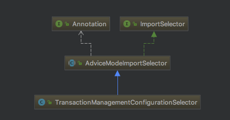
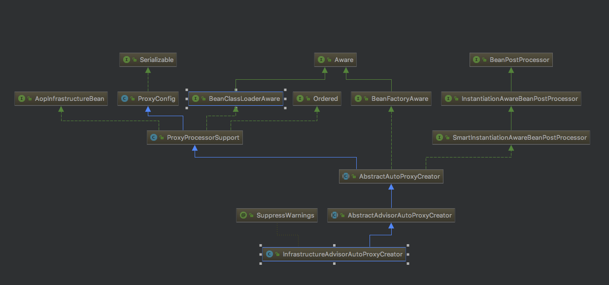
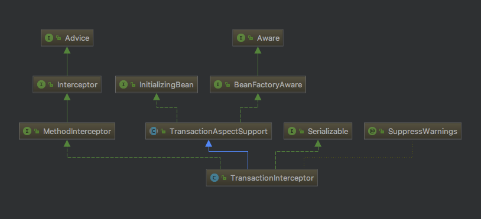
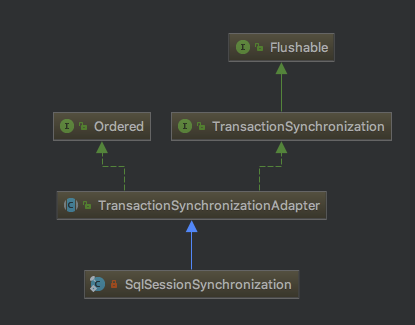
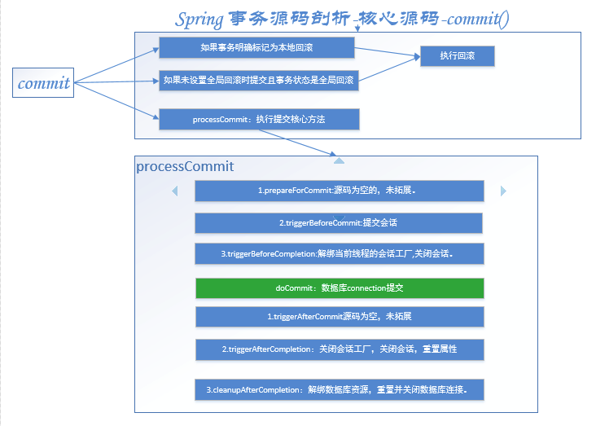

## Spring 源码之事物核心源码

- [spring 事物详解原文](https://www.cnblogs.com/dennyzhangdd/p/9602673.html#_label3_0)

### 在Spring中，事务有两种实现方式：

- 编程式事务管理： 编程式事务管理使用TransactionTemplate可实现更细粒度的事务控制。
- 申明式事务管理： 基于Spring AOP实现。其本质是对方法前后进行拦截，然后在目标方法开始之前创建或者加入一个事务，在执行完目标方法之后根据执行情况提交或者回滚事务。
申明式事务管理不需要入侵代码，通过@Transactional就可以进行事务操作，更快捷而且简单（尤其是配合spring boot自动配置，可以说是精简至极！），且大部分业务都可以满足，推荐使用。
  

### 事务源码

### 2.1 编程式事务TransactionTemplate

- 编程式事务，Spring已经给我们提供好了模板类`TransactionTemplate`，可以很方便的使用，如下图：


- TransactionTemplate全路径名是：`org.springframework.transaction.support.TransactionTemplate`。看包名也知道了这是spring对事务的模板类. 看下类图先：


````java
public interface TransactionOperations {

    /**
     * Execute the action specified by the given callback object within a transaction.
     * <p>Allows for returning a result object created within the transaction, that is,
     * a domain object or a collection of domain objects. A RuntimeException thrown
     * by the callback is treated as a fatal exception that enforces a rollback.
     * Such an exception gets propagated to the caller of the template.
     * @param action the callback object that specifies the transactional action
     * @return a result object returned by the callback, or {@code null} if none
     * @throws TransactionException in case of initialization, rollback, or system errors
     * @throws RuntimeException if thrown by the TransactionCallback
     */
    <T> T execute(TransactionCallback<T> action) throws TransactionException;

}

public interface InitializingBean {

    /**
     * Invoked by a BeanFactory after it has set all bean properties supplied
     * (and satisfied BeanFactoryAware and ApplicationContextAware).
     * <p>This method allows the bean instance to perform initialization only
     * possible when all bean properties have been set and to throw an
     * exception in the event of misconfiguration.
     * @throws Exception in the event of misconfiguration (such
     * as failure to set an essential property) or if initialization fails.
     */
    void afterPropertiesSet() throws Exception;

}

````

如上图，TransactionOperations这个接口用来执行事务的回调方法，InitializingBean这个是典型的spring bean初始化流程中的预留接口，专用用来在bean属性加载完毕时执行的方法。

- TransactionTemplate的2个接口的impl方法做了什么？

````java
@Override
    public void afterPropertiesSet() {
        if (this.transactionManager == null) {
            throw new IllegalArgumentException("Property 'transactionManager' is required");
        }
    }


    @Override
    public <T> T execute(TransactionCallback<T> action) throws TransactionException {　　　　　　　// 内部封装好的事务管理器
        if (this.transactionManager instanceof CallbackPreferringPlatformTransactionManager) {
            return ((CallbackPreferringPlatformTransactionManager) this.transactionManager).execute(this, action);
        }// 需要手动获取事务，执行方法，提交事务的管理器
        else {// 1.获取事务状态
            TransactionStatus status = this.transactionManager.getTransaction(this);
            T result;
            try {// 2.执行业务逻辑
                result = action.doInTransaction(status);
            }
            catch (RuntimeException ex) {
                // 应用运行时异常 -> 回滚
                rollbackOnException(status, ex);
                throw ex;
            }
            catch (Error err) {
                // Error异常 -> 回滚
                rollbackOnException(status, err);
                throw err;
            }
            catch (Throwable ex) {
                // 未知异常 -> 回滚
                rollbackOnException(status, ex);
                throw new UndeclaredThrowableException(ex, "TransactionCallback threw undeclared checked exception");
            }// 3.事务提交
            this.transactionManager.commit(status);
            return result;
        }
    }

````

- 如上图所示，实际上afterPropertiesSet只是校验了事务管理器不为空，execute()才是核心方法，execute主要步骤：

  - getTransaction()获取事务，源码见3.3.1
  - doInTransaction()执行业务逻辑，这里就是用户自定义的业务代码。如果是没有返回值的，就是doInTransactionWithoutResult()。
  - commit()事务提交：调用AbstractPlatformTransactionManager的commit，rollbackOnException()异常回滚：调用AbstractPlatformTransactionManager的rollback()，事务提交回滚，源码见3.3.3
    
### 申明式事务@Transactional

#### AOP相关概念

申明式事务使用的是spring AOP，即面向切面编程。AOP核心概念如下：

- `通知（Advice）`:定义了切面(各处业务代码中都需要的逻辑提炼成的一个切面)做什么what+when何时使用。例如：前置通知Before、后置通知After、返回通知After-returning、异常通知After-throwing、环绕通知Around.
- `连接点（Joint point）`：程序执行过程中能够插入切面的点，一般有多个。比如调用方式时、抛出异常时。
- `切点（Pointcut）`:切点定义了连接点，切点包含多个连接点,即where哪里使用通知.通常指定类+方法 或者 正则表达式来匹配 类和方法名称。
- `切面（Aspect）`:切面=通知+切点，即when+where+what何时何地做什么。
- `引入（Introduction）`:允许我们向现有的类添加新方法或属性。
- `织入（Weaving）`:织入是把切面应用到目标对象并创建新的代理对象的过程。

## 申明式事务

申明式事务整体调用过程，可以抽出2条线：

- 使用代理模式，生成代理增强类。

- 根据代理事务管理配置类，配置事务的织入，在业务方法前后进行环绕增强，增加一些事务的相关操作。例如获取事务属性、提交事务、回滚事务。

过程如下：


- 申明式事务使用@Transactional这种注解的方式，那么我们就从springboot 容器启动时的自动配置载入（spring boot容器启动详解）开始看。在/META-INF/spring.factories中配置文件中查找，如下图：


载入2个关于事务的自动配置类： 

- org.springframework.boot.autoconfigure.transaction.TransactionAutoConfiguration,
- org.springframework.boot.autoconfigure.transaction.jta.JtaAutoConfiguration,

### TransactionAutoConfiguration自动配置类

````java
@Configuration
@ConditionalOnClass(PlatformTransactionManager.class)
@AutoConfigureAfter({ JtaAutoConfiguration.class, HibernateJpaAutoConfiguration.class,
        DataSourceTransactionManagerAutoConfiguration.class,
        Neo4jDataAutoConfiguration.class })
@EnableConfigurationProperties(TransactionProperties.class)
public class TransactionAutoConfiguration {

    @Bean
    @ConditionalOnMissingBean
    public TransactionManagerCustomizers platformTransactionManagerCustomizers(
            ObjectProvider<List<PlatformTransactionManagerCustomizer<?>>> customizers) {
        return new TransactionManagerCustomizers(customizers.getIfAvailable());
    }

    @Configuration
    @ConditionalOnSingleCandidate(PlatformTransactionManager.class)
    public static class TransactionTemplateConfiguration {

        private final PlatformTransactionManager transactionManager;

        public TransactionTemplateConfiguration(
                PlatformTransactionManager transactionManager) {
            this.transactionManager = transactionManager;
        }

        @Bean
        @ConditionalOnMissingBean
        public TransactionTemplate transactionTemplate() {
            return new TransactionTemplate(this.transactionManager);
        }
    }

    @Configuration
    @ConditionalOnBean(PlatformTransactionManager.class)
    @ConditionalOnMissingBean(AbstractTransactionManagementConfiguration.class)
    public static class EnableTransactionManagementConfiguration {

        @Configuration
        @EnableTransactionManagement(proxyTargetClass = false)
        @ConditionalOnProperty(prefix = "spring.aop", name = "proxy-target-class", havingValue = "false", matchIfMissing = false)
        public static class JdkDynamicAutoProxyConfiguration {

        }

        @Configuration
        @EnableTransactionManagement(proxyTargetClass = true)
        @ConditionalOnProperty(prefix = "spring.aop", name = "proxy-target-class", havingValue = "true", matchIfMissing = true)
        public static class CglibAutoProxyConfiguration {

        }

    }

}


````
### 2个类注解

- @ConditionalOnClass(PlatformTransactionManager.class) 即类路径下包含 PlatformTransactionManager 这个类时这个自动配置生效，这个类是spring事务的核心包，肯定引入了。

- @AutoConfigureAfter({ JtaAutoConfiguration.class, HibernateJpaAutoConfiguration.class, DataSourceTransactionManagerAutoConfiguration.class, Neo4jDataAutoConfiguration.class })，这个配置在括号中的4个配置类后才生效。

### 2个内部类

- TransactionTemplateConfiguration事务模板配置类：

  - @ConditionalOnSingleCandidate(PlatformTransactionManager.class)当能够唯一确定一个PlatformTransactionManager bean时才生效。

  - @ConditionalOnMissingBean如果没有定义TransactionTemplate bean生成一个。
  

- EnableTransactionManagementConfiguration开启事务管理器配置类：

  - @ConditionalOnBean(PlatformTransactionManager.class)当存在PlatformTransactionManager bean时生效。

  - @ConditionalOnMissingBean(AbstractTransactionManagementConfiguration.class)当没有自定义抽象事务管理器配置类时才生效。（即用户自定义抽象事务管理器配置类会优先，如果没有，就用这个默认事务管理器配置类）

#### EnableTransactionManagementConfiguration支持2种代理方式：

- 1.JdkDynamicAutoProxyConfiguration：
  
  - @EnableTransactionManagement(proxyTargetClass = false)，即proxyTargetClass = false表示是JDK动态代理支持的是：面向接口代理。

  - @ConditionalOnProperty(prefix = "spring.aop", name = "proxy-target-class", havingValue = "false", matchIfMissing = false)，即spring.aop.proxy-target-class=false时生效，且没有这个配置不生效。
- 2.CglibAutoProxyConfiguration：
  - @EnableTransactionManagement(proxyTargetClass = true)，即proxyTargetClass = true标识Cglib代理支持的是子类继承代理。
  - @ConditionalOnProperty(prefix = "spring.aop", name = "proxy-target-class", havingValue = "true", matchIfMissing = true)，即spring.aop.proxy-target-class=true时生效，且没有这个配置默认生效。

**注意了，默认没有配置，走的Cglib代理。说明@Transactional注解支持直接加在类上。**

#### @EnableTransactionManagement注解

````java
@Target(ElementType.TYPE)
@Retention(RetentionPolicy.RUNTIME)
@Documented
@Import(TransactionManagementConfigurationSelector.class)
public @interface EnableTransactionManagement {

    //proxyTargetClass = false表示是JDK动态代理支持接口代理。true表示是Cglib代理支持子类继承代理。
    boolean proxyTargetClass() default false;

    //事务通知模式(切面织入方式)，默认代理模式（同一个类中方法互相调用拦截器不会生效），可以选择增强型AspectJ
    AdviceMode mode() default AdviceMode.PROXY;

    //连接点上有多个通知时，排序，默认最低。值越大优先级越低。
    int order() default Ordered.LOWEST_PRECEDENCE;

}
````

- 重点看类注解@Import(TransactionManagementConfigurationSelector.class)TransactionManagementConfigurationSelector类图如下：



- 如上图所示，TransactionManagementConfigurationSelector继承自AdviceModeImportSelector实现了ImportSelector接口。

````java
public class TransactionManagementConfigurationSelector extends AdviceModeImportSelector<EnableTransactionManagement> {

    /**
     * {@inheritDoc}
     * @return {@link ProxyTransactionManagementConfiguration} or
     * {@code AspectJTransactionManagementConfiguration} for {@code PROXY} and
     * {@code ASPECTJ} values of {@link EnableTransactionManagement#mode()}, respectively
     */
    @Override
    protected String[] selectImports(AdviceMode adviceMode) {
        switch (adviceMode) {
            case PROXY:
                return new String[] {AutoProxyRegistrar.class.getName(), ProxyTransactionManagementConfiguration.class.getName()};
            case ASPECTJ:
                return new String[] {TransactionManagementConfigUtils.TRANSACTION_ASPECT_CONFIGURATION_CLASS_NAME};
            default:
                return null;
        }
    }

}
````
如上图，最终会执行selectImports方法导入需要加载的类，我们只看proxy模式下，载入了AutoProxyRegistrar、ProxyTransactionManagementConfiguration2个类。

- **AutoProxyRegistrar**
  给容器中注册一个 InfrastructureAdvisorAutoProxyCreator 组件；利用后置处理器机制在对象创建以后，包装对象，返回一个代理对象（增强器），代理对象执行方法利用拦截器链进行调用；
  
- **ProxyTransactionManagementConfiguration**：就是一个配置类，定义了事务增强器。

### AutoProxyRegistrar

````java
public void registerBeanDefinitions(AnnotationMetadata importingClassMetadata, BeanDefinitionRegistry registry) {
        boolean candidateFound = false;
        Set<String> annoTypes = importingClassMetadata.getAnnotationTypes();
        for (String annoType : annoTypes) {
            AnnotationAttributes candidate = AnnotationConfigUtils.attributesFor(importingClassMetadata, annoType);
            if (candidate == null) {
                continue;
            }
            Object mode = candidate.get("mode");
            Object proxyTargetClass = candidate.get("proxyTargetClass");
            if (mode != null && proxyTargetClass != null && AdviceMode.class == mode.getClass() &&
                    Boolean.class == proxyTargetClass.getClass()) {
                candidateFound = true;
                if (mode == AdviceMode.PROXY) {//代理模式
                    AopConfigUtils.registerAutoProxyCreatorIfNecessary(registry);
                    if ((Boolean) proxyTargetClass) {//如果是CGLOB子类代理模式
                        AopConfigUtils.forceAutoProxyCreatorToUseClassProxying(registry);
                        return;
                    }
                }
            }
        }
        if (!candidateFound) {
            String name = getClass().getSimpleName();
            logger.warn(String.format("%s was imported but no annotations were found " +
                    "having both 'mode' and 'proxyTargetClass' attributes of type " +
                    "AdviceMode and boolean respectively. This means that auto proxy " +
                    "creator registration and configuration may not have occurred as " +
                    "intended, and components may not be proxied as expected. Check to " +
                    "ensure that %s has been @Import'ed on the same class where these " +
                    "annotations are declared; otherwise remove the import of %s " +
                    "altogether.", name, name, name));
        }
    }
````

#### 代理模式：AopConfigUtils.registerAutoProxyCreatorIfNecessary(registry);

- 最终调用的是: registerOrEscalateApcAsRequired(InfrastructureAdvisorAutoProxyCreator.class, registry, source);基础构建增强自动代理构造器

- Escalate(升级)

````java
private static BeanDefinition registerOrEscalateApcAsRequired(Class<?> cls, BeanDefinitionRegistry registry, Object source) {
        Assert.notNull(registry, "BeanDefinitionRegistry must not be null");　　　　　　 
        //如果当前注册器包含:internalAutoProxyCreator
        if (registry.containsBeanDefinition(AUTO_PROXY_CREATOR_BEAN_NAME)) {
            //org.springframework.aop.config.internalAutoProxyCreator内部自动代理构造器
            BeanDefinition apcDefinition = registry.getBeanDefinition(AUTO_PROXY_CREATOR_BEAN_NAME);
            if (!cls.getName().equals(apcDefinition.getBeanClassName())) {
                //如果当前类不是internalAutoProxyCreator
                int currentPriority = findPriorityForClass(apcDefinition.getBeanClassName());
                int requiredPriority = findPriorityForClass(cls);
                if (currentPriority < requiredPriority) {
                    //如果下标大于已存在的内部自动代理构造器，index越小，优先级越高,InfrastructureAdvisorAutoProxyCreator index=0,requiredPriority最小，不进入
                    apcDefinition.setBeanClassName(cls.getName());
                }
            }
            return null;//直接返回
        }
        //如果当前注册器不包含internalAutoProxyCreator，则把当前类作为根定义
        RootBeanDefinition beanDefinition = new RootBeanDefinition(cls);
        beanDefinition.setSource(source);
        beanDefinition.getPropertyValues().add("order", Ordered.HIGHEST_PRECEDENCE);//优先级最高
        beanDefinition.setRole(BeanDefinition.ROLE_INFRASTRUCTURE);
        registry.registerBeanDefinition(AUTO_PROXY_CREATOR_BEAN_NAME, beanDefinition);
        return beanDefinition;
    }
````

如上，APC_PRIORITY_LIST列表如下图：

````java
/**
     * Stores the auto proxy creator classes in escalation order.
     */
    private static final List<Class<?>> APC_PRIORITY_LIST = new ArrayList<Class<?>>();

    /**
     * 优先级上升list
     */
    static {
        //基础设施
        APC_PRIORITY_LIST.add(InfrastructureAdvisorAutoProxyCreator.class);
        APC_PRIORITY_LIST.add(AspectJAwareAdvisorAutoProxyCreator.class);
        APC_PRIORITY_LIST.add(AnnotationAwareAspectJAutoProxyCreator.class);
    }
````

如上，由于`InfrastructureAdvisorAutoProxyCreator`这个类在list中第一个index=0,requiredPriority最小，不进入，所以没有重置beanClassName，啥都没做，返回null.

那么增强代理类何时生成呢？

`InfrastructureAdvisorAutoProxyCreator`类图如下：




如上图所示，看2个核心方法：InstantiationAwareBeanPostProcessor接口的postProcessBeforeInstantiation实例化前+BeanPostProcessor接口的postProcessAfterInitialization初始化后

````java
      @Override
       public Object postProcessBeforeInstantiation(Class<?> beanClass, String beanName) throws BeansException {
                 Object cacheKey = getCacheKey(beanClass, beanName);
        
                 if (beanName == null || !this.targetSourcedBeans.contains(beanName)) {
                     if (this.advisedBeans.containsKey(cacheKey)) {//如果已经存在直接返回
                         return null;
                     }
                     //是否基础构件（基础构建不需要代理）：Advice、Pointcut、Advisor、AopInfrastructureBean这四类都算基础构建
                     if (isInfrastructureClass(beanClass) || shouldSkip(beanClass, beanName)) {
                         this.advisedBeans.put(cacheKey, Boolean.FALSE);//添加进advisedBeans ConcurrentHashMap<k=Object,v=Boolean>标记是否需要增强实现，这里基础构建bean不需要代理，都置为false，供后面postProcessAfterInitialization实例化后使用。
                         return null;
                     }
                 }
        
                 // TargetSource是spring aop预留给我们用户自定义实例化的接口，如果存在TargetSource就不会默认实例化，而是按照用户自定义的方式实例化，咱们没有定义，不进入
                 if (beanName != null) {
                     TargetSource targetSource = getCustomTargetSource(beanClass, beanName);
                     if (targetSource != null) {
                           this.targetSourcedBeans.add(beanName);
                           Object[] specificInterceptors = getAdvicesAndAdvisorsForBean(beanClass, beanName, targetSource);
                           //重点:创建代理类
                           Object proxy = createProxy(beanClass, beanName, specificInterceptors, targetSource);
                           this.proxyTypes.put(cacheKey, proxy.getClass());
                           return prox
                     }
                 }
         
                  return null;
}
````

- 通过追踪，由于InfrastructureAdvisorAutoProxyCreator是基础构建类，advisedBeans.put(cacheKey, Boolean.FALSE)

- 添加进: advisedBeans ConcurrentHashMap<k=Object,v=Boolean>标记是否需要增强实现，这里基础构建bean不需要代理，都置为false，供后面: postProcessAfterInitialization实例化后使用。

#### postProcessAfterInitialization源码如下：

````java
@Override
    public Object postProcessAfterInitialization(Object bean, String beanName) throws BeansException {
        if (bean != null) {
            Object cacheKey = getCacheKey(bean.getClass(), beanName);
            if (!this.earlyProxyReferences.contains(cacheKey)) {
                return wrapIfNecessary(bean, beanName, cacheKey);
            }
        }
        return bean;
    }

    protected Object wrapIfNecessary(Object bean, String beanName, Object cacheKey) {　　　　　　 // 如果是用户自定义获取实例，不需要增强处理，直接返回
        if (beanName != null && this.targetSourcedBeans.contains(beanName)) {
            return bean;
        }
        // 查询map缓存，标记过false,不需要增强直接返回
        if (Boolean.FALSE.equals(this.advisedBeans.get(cacheKey))) {
            return bean;
        }
        // 判断一遍springAOP基础构建类，标记过false,不需要增强直接返回
        if (isInfrastructureClass(bean.getClass()) || shouldSkip(bean.getClass(), beanName)) {
            this.advisedBeans.put(cacheKey, Boolean.FALSE);
            return bean;
        }

        // 获取增强List<Advisor> advisors
        Object[] specificInterceptors = getAdvicesAndAdvisorsForBean(bean.getClass(), beanName, null);　　　　　　 // 如果存在增强
        if (specificInterceptors != DO_NOT_PROXY) {
            this.advisedBeans.put(cacheKey, Boolean.TRUE);
            // 标记增强为TRUE,表示需要增强实现　　　　　　　　  
             // 生成增强代理类
            Object proxy = createProxy(bean.getClass(), beanName, specificInterceptors, new SingletonTargetSource(bean));
            this.proxyTypes.put(cacheKey, proxy.getClass());
            return proxy;
        }
　　　　 // 如果不存在增强，标记false,作为缓存，再次进入提高效率，第16行利用缓存先校验
        this.advisedBeans.put(cacheKey, Boolean.FALSE);
        return bean;
    }

````

#### 下面看核心方法createProxy如下：

````java
protected Object createProxy(
            Class<?> beanClass, String beanName, Object[] specificInterceptors, TargetSource targetSource) {
　　　　 // 如果是ConfigurableListableBeanFactory接口（咱们DefaultListableBeanFactory就是该接口的实现类）则，暴露目标类
        if (this.beanFactory instanceof ConfigurableListableBeanFactory) {　
           //给beanFactory->beanDefinition定义一个属性：k=AutoProxyUtils.originalTargetClass,v=需要被代理的bean class
            AutoProxyUtils.exposeTargetClass((ConfigurableListableBeanFactory) this.beanFactory, beanName, beanClass);
        }

        ProxyFactory proxyFactory = new ProxyFactory();
        proxyFactory.copyFrom(this);
　　　　 //如果不是代理目标类
        if (!proxyFactory.isProxyTargetClass()) {
            //如果beanFactory定义了代理目标类（CGLIB）
            if (shouldProxyTargetClass(beanClass, beanName)) {
                proxyFactory.setProxyTargetClass(true);//代理工厂设置代理目标类
            }
            else {
                //否则设置代理接口（JDK）
                evaluateProxyInterfaces(beanClass, proxyFactory);
            }
        }
　　　　 //把拦截器包装成增强（通知）
        Advisor[] advisors = buildAdvisors(beanName, specificInterceptors);
        proxyFactory.addAdvisors(advisors);//设置进代理工厂
        proxyFactory.setTargetSource(targetSource);
        customizeProxyFactory(proxyFactory);//空方法，留给子类拓展用，典型的spring的风格，喜欢处处留后路
　　　　 //用于控制代理工厂是否还允许再次添加通知，默认为false（表示不允许）
        proxyFactory.setFrozen(this.freezeProxy);
        if (advisorsPreFiltered()) {//默认false，上面已经前置过滤了匹配的增强Advisor
            proxyFactory.setPreFiltered(true);
        }
        //代理工厂获取代理对象的核心方法
        return proxyFactory.getProxy(getProxyClassLoader());
    }


````

最终我们生成的是CGLIB代理类.到此为止我们分析完了代理类的构造过程。

-----
### ProxyTransactionManagementConfiguration
下面来看ProxyTransactionManagementConfiguration：

````java
@Configuration
public class ProxyTransactionManagementConfiguration extends AbstractTransactionManagementConfiguration {

    @Bean(name = TransactionManagementConfigUtils.TRANSACTION_ADVISOR_BEAN_NAME)
    @Role(BeanDefinition.ROLE_INFRASTRUCTURE)//定义事务增强器
    public BeanFactoryTransactionAttributeSourceAdvisor transactionAdvisor() {
        BeanFactoryTransactionAttributeSourceAdvisor j = new BeanFactoryTransactionAttributeSourceAdvisor();
        advisor.setTransactionAttributeSource(transactionAttributeSource());
        advisor.setAdvice(transactionInterceptor());
        advisor.setOrder(this.enableTx.<Integer>getNumber("order"));
        return advisor;
    }

    @Bean
    @Role(BeanDefinition.ROLE_INFRASTRUCTURE)//定义基于注解的事务属性资源
    public TransactionAttributeSource transactionAttributeSource() {
        return new AnnotationTransactionAttributeSource();
    }

    @Bean
    @Role(BeanDefinition.ROLE_INFRASTRUCTURE)//定义事务拦截器
    public TransactionInterceptor transactionInterceptor() {
        TransactionInterceptor interceptor = new TransactionInterceptor();
        interceptor.setTransactionAttributeSource(transactionAttributeSource());
        if (this.txManager != null) {
            interceptor.setTransactionManager(this.txManager);
        }
        return interceptor;
    }

}

````

核心方法：transactionAdvisor()事务织入

定义了一个advisor，设置事务属性、设置事务拦截器TransactionInterceptor、设置顺序。核心就是事务拦截器TransactionInterceptor。

TransactionInterceptor使用通用的spring事务基础架构实现“声明式事务”，继承自TransactionAspectSupport类（该类包含与Spring的底层事务API的集成），实现了MethodInterceptor接口。spring类图如下：



事务拦截器的拦截功能就是依靠实现了MethodInterceptor接口，熟悉spring的同学肯定很熟悉MethodInterceptor了，这个是spring的方法拦截器，主要看invoke方法：

````java
@Override
    public Object invoke(final MethodInvocation invocation) throws Throwable {
        // Work out the target class: may be {@code null}.
        // The TransactionAttributeSource should be passed the target class
        // as well as the method, which may be from an interface.
        Class<?> targetClass = (invocation.getThis() != null ? AopUtils.getTargetClass(invocation.getThis()) : null);

        // 调用TransactionAspectSupport的 invokeWithinTransaction方法
        return invokeWithinTransaction(invocation.getMethod(), targetClass, new InvocationCallback() {
            @Override
            public Object proceedWithInvocation() throws Throwable {
                return invocation.proceed();
            }
        });
    }
````

如上图TransactionInterceptor复写MethodInterceptor接口的invoke方法，并在invoke方法中调用了父类TransactionAspectSupport的invokeWithinTransaction()方法，源码如下：

````java
protected Object invokeWithinTransaction(Method method, Class<?> targetClass, final InvocationCallback invocation)
            throws Throwable {

        // 如果transaction attribute为空,该方法就是非事务（非编程式事务）
        final TransactionAttribute txAttr = getTransactionAttributeSource().getTransactionAttribute(method, targetClass);
        final PlatformTransactionManager tm = determineTransactionManager(txAttr);
        final String joinpointIdentification = methodIdentification(method, targetClass, txAttr);
　　　　 // 标准声明式事务：如果事务属性为空 或者 非回调偏向的事务管理器
        if (txAttr == null || !(tm instanceof CallbackPreferringPlatformTransactionManager)) {
            // Standard transaction demarcation with getTransaction and commit/rollback calls.
            TransactionInfo txInfo = createTransactionIfNecessary(tm, txAttr, joinpointIdentification);
            Object retVal = null;
            try {
                // 这里就是一个环绕增强，在这个proceed前后可以自己定义增强实现
                // 方法执行
                retVal = invocation.proceedWithInvocation();
            }
            catch (Throwable ex) {
                // 根据事务定义的，该异常需要回滚就回滚，否则提交事务
                completeTransactionAfterThrowing(txInfo, ex);
                throw ex;
            }
            finally {//清空当前事务信息，重置为老的
                cleanupTransactionInfo(txInfo);
            }//返回结果之前提交事务
            commitTransactionAfterReturning(txInfo);
            return retVal;
        }
　　　　 // 编程式事务：（回调偏向）
        else {
            final ThrowableHolder throwableHolder = new ThrowableHolder();

            // It's a CallbackPreferringPlatformTransactionManager: pass a TransactionCallback in.
            try {
                Object result = ((CallbackPreferringPlatformTransactionManager) tm).execute(txAttr,
                        new TransactionCallback<Object>() {
                            @Override
                            public Object doInTransaction(TransactionStatus status) {
                                TransactionInfo txInfo = prepareTransactionInfo(tm, txAttr, joinpointIdentification, status);
                                try {
                                    return invocation.proceedWithInvocation();
                                }
                                catch (Throwable ex) {// 如果该异常需要回滚
                                    if (txAttr.rollbackOn(ex)) {
                                        // 如果是运行时异常返回
                                        if (ex instanceof RuntimeException) {
                                            throw (RuntimeException) ex;
                                        }// 如果是其它异常都抛ThrowableHolderException
                                        else {
                                            throw new ThrowableHolderException(ex);
                                        }
                                    }// 如果不需要回滚
                                    else {
                                        // 定义异常，最终就直接提交事务了
                                        throwableHolder.throwable = ex;
                                        return null;
                                    }
                                }
                                finally {//清空当前事务信息，重置为老的
                                    cleanupTransactionInfo(txInfo);
                                }
                            }
                        });

                // 上抛异常
                if (throwableHolder.throwable != null) {
                    throw throwableHolder.throwable;
                }
                return result;
            }
            catch (ThrowableHolderException ex) {
                throw ex.getCause();
            }
            catch (TransactionSystemException ex2) {
                if (throwableHolder.throwable != null) {
                    logger.error("Application exception overridden by commit exception", throwableHolder.throwable);
                    ex2.initApplicationException(throwableHolder.throwable);
                }
                throw ex2;
            }
            catch (Throwable ex2) {
                if (throwableHolder.throwable != null) {
                    logger.error("Application exception overridden by commit exception", throwableHolder.throwable);
                }
                throw ex2;
            }
        }
    }
````

如上图，我们主要看第一个分支，申明式事务，核心流程如下：

- createTransactionIfNecessary():如果有必要，创建事务

- InvocationCallback的proceedWithInvocation()：InvocationCallback是父类的内部回调接口，子类中实现该接口供父类调用，子类TransactionInterceptor中invocation.proceed()。回调方法执行

- 异常回滚completeTransactionAfterThrowing()

#### 1.createTransactionIfNecessary()

````java
protected TransactionInfo createTransactionIfNecessary(
            PlatformTransactionManager tm, TransactionAttribute txAttr, final String joinpointIdentification) {

        // 如果还没有定义名字，把连接点的ID定义成事务的名称
        if (txAttr != null && txAttr.getName() == null) {
            txAttr = new DelegatingTransactionAttribute(txAttr) {
                @Override
                public String getName() {
                    return joinpointIdentification;
                }
            };
        }

        TransactionStatus status = null;
        if (txAttr != null) {
            if (tm != null) {
                status = tm.getTransaction(txAttr);
            }
            else {
                if (logger.isDebugEnabled()) {
                    logger.debug("Skipping transactional joinpoint [" + joinpointIdentification +
                            "] because no transaction manager has been configured");
                }
            }
        }
        return prepareTransactionInfo(tm, txAttr, joinpointIdentification, status);
    }

````
核心就是：

- getTransaction()，根据事务属性获取事务TransactionStatus，大道归一，都是调用PlatformTransactionManager.getTransaction()，源码见3.3.1。
- prepareTransactionInfo(),构造一个TransactionInfo事务信息对象，绑定当前线程：ThreadLocal<TransactionInfo>。

#### 2.invocation.proceed()回调业务方法:


如上图，ReflectiveMethodInvocation类实现了ProxyMethodInvocation接口，但是ProxyMethodInvocation继承了3层接口...ProxyMethodInvocation->MethodInvocation->Invocation->Joinpoint

- Joinpoint：连接点接口，定义了执行接口：Object proceed() throws Throwable; 执行当前连接点，并跳到拦截器链上的下一个拦截器。

- Invocation：调用接口，继承自Joinpoint，定义了获取参数接口： Object[] getArguments();是一个带参数的、可被拦截器拦截的连接点。

- MethodInvocation：方法调用接口，继承自Invocation，定义了获取方法接口：Method getMethod(); 是一个带参数的可被拦截的连接点方法。

- ProxyMethodInvocation：代理方法调用接口，继承自MethodInvocation，定义了获取代理对象接口：Object getProxy();是一个由代理类执行的方法调用连接点方法。

- ReflectiveMethodInvocation：实现了ProxyMethodInvocation接口，自然就实现了父类接口的的所有接口。获取代理类，获取方法，获取参数，用代理类执行这个方法并且自动跳到下一个连接点。

下面看一下proceed方法源码：

````java
1 @Override
 2     public Object proceed() throws Throwable {
 3         //    启动时索引为-1，唤醒连接点，后续递增
 4         if (this.currentInterceptorIndex == this.interceptorsAndDynamicMethodMatchers.size() - 1) {
 5             return invokeJoinpoint();
 6         }
 7 
 8         Object interceptorOrInterceptionAdvice =
 9                 this.interceptorsAndDynamicMethodMatchers.get(++this.currentInterceptorIndex);
10         if (interceptorOrInterceptionAdvice instanceof InterceptorAndDynamicMethodMatcher) {
11             // 这里进行动态方法匹配校验，静态的方法匹配早已经校验过了（MethodMatcher接口有两种典型：动态/静态校验）
13             InterceptorAndDynamicMethodMatcher dm =
14                     (InterceptorAndDynamicMethodMatcher) interceptorOrInterceptionAdvice;
15             if (dm.methodMatcher.matches(this.method, this.targetClass, this.arguments)) {
16                 return dm.interceptor.invoke(this);
17             }
18             else {
19                 // 动态匹配失败，跳过当前拦截，进入下一个（拦截器链）
21                 return proceed();
22             }
23         }
24         else {
25             // 它是一个拦截器，所以我们只调用它:在构造这个对象之前，切入点将被静态地计算。
27             return ((MethodInterceptor) interceptorOrInterceptionAdvice).invoke(this);
28         }
29     }

````

咱们这里最终调用的是((MethodInterceptor) interceptorOrInterceptionAdvice).invoke(this);就是TransactionInterceptor事务拦截器回调 目标业务方法（addUserBalanceAndUser）。

### 3.completeTransactionAfterThrowing()

最终调用AbstractPlatformTransactionManager的rollback()，提交事务commitTransactionAfterReturning()最终调用AbstractPlatformTransactionManager的commit(),源码见3.3.3

---

## 事务核心源码


如上提所示，PlatformTransactionManager顶级接口定义了最核心的事务管理方法，下面一层是AbstractPlatformTransactionManager抽象类，实现了PlatformTransactionManager接口的方法并定义了一些抽象方法，供子类拓展。最后下面一层是2个经典事务管理器：

- 1.DataSourceTransactionmanager,即JDBC单数据库事务管理器，基于Connection实现，

- 2.JtaTransactionManager,即多数据库事务管理器（又叫做分布式事务管理器），其实现了JTA规范，使用XA协议进行两阶段提交。

我们这里只看基于JDBC connection的DataSourceTransactionmanager源码。

### PlatformTransactionManager接口：
````java
public interface PlatformTransactionManager {
    // 获取事务状态
    TransactionStatus getTransaction(TransactionDefinition definition) throws TransactionException;
　　// 事务提交
    void commit(TransactionStatus status) throws TransactionException;
　　// 事务回滚
    void rollback(TransactionStatus status) throws TransactionException;
}
````

#### getTransaction获取事务


AbstractPlatformTransactionManager实现了getTransaction()方法如下：

````java

@Override
    public final TransactionStatus getTransaction(TransactionDefinition definition) throws TransactionException {
        Object transaction = doGetTransaction();

        // Cache debug flag to avoid repeated checks.
        boolean debugEnabled = logger.isDebugEnabled();

        if (definition == null) {
            // Use defaults if no transaction definition given.
            definition = new DefaultTransactionDefinition();
        }
　　　　  // 如果当前已经存在事务
        if (isExistingTransaction(transaction)) {
            // 根据不同传播机制不同处理
            return handleExistingTransaction(definition, transaction, debugEnabled);
        }

        // 超时不能小于默认值
        if (definition.getTimeout() < TransactionDefinition.TIMEOUT_DEFAULT) {
            throw new InvalidTimeoutException("Invalid transaction timeout", definition.getTimeout());
        }

        // 当前不存在事务，传播机制=MANDATORY（支持当前事务，没事务报错），报错
        if (definition.getPropagationBehavior() == TransactionDefinition.PROPAGATION_MANDATORY) {
            throw new IllegalTransactionStateException(
                    "No existing transaction found for transaction marked with propagation 'mandatory'");
        }// 当前不存在事务，传播机制=REQUIRED/REQUIRED_NEW/NESTED,这三种情况，需要新开启事务，且加上事务同步
        else if (definition.getPropagationBehavior() == TransactionDefinition.PROPAGATION_REQUIRED ||
                definition.getPropagationBehavior() == TransactionDefinition.PROPAGATION_REQUIRES_NEW ||
                definition.getPropagationBehavior() == TransactionDefinition.PROPAGATION_NESTED) {
            SuspendedResourcesHolder suspendedResources = suspend(null);
            if (debugEnabled) {
                logger.debug("Creating new transaction with name [" + definition.getName() + "]: " + definition);
            }
            try {// 是否需要新开启同步// 开启// 开启
                boolean newSynchronization = (getTransactionSynchronization() != SYNCHRONIZATION_NEVER);
                DefaultTransactionStatus status = newTransactionStatus(
                        definition, transaction, true, newSynchronization, debugEnabled, suspendedResources);
                doBegin(transaction, definition);// 开启新事务
                prepareSynchronization(status, definition);//预备同步
                return status;
            }
            catch (RuntimeException ex) {
                resume(null, suspendedResources);
                throw ex;
            }
            catch (Error err) {
                resume(null, suspendedResources);
                throw err;
            }
        }
        else {
            // 当前不存在事务当前不存在事务，且传播机制=PROPAGATION_SUPPORTS/PROPAGATION_NOT_SUPPORTED/PROPAGATION_NEVER，这三种情况，创建“空”事务:没有实际事务，但可能是同步。警告：定义了隔离级别，但并没有真实的事务初始化，隔离级别被忽略有隔离级别但是并没有定义实际的事务初始化，有隔离级别但是并没有定义实际的事务初始化，
            if (definition.getIsolationLevel() != TransactionDefinition.ISOLATION_DEFAULT && logger.isWarnEnabled()) {
                logger.warn("Custom isolation level specified but no actual transaction initiated; " +
                        "isolation level will effectively be ignored: " + definition);
            }
            boolean newSynchronization = (getTransactionSynchronization() == SYNCHRONIZATION_ALWAYS);
            return prepareTransactionStatus(definition, null, true, newSynchronization, debugEnabled, null);
        }
    }

````

如上图，源码分成了2条处理线，

- 当前已存在事务：isExistingTransaction()判断是否存在事务，存在事务handleExistingTransaction()根据不同传播机制不同处理

- 当前不存在事务: 不同传播机制不同处理

handleExistingTransaction()源码如下：

````java
private TransactionStatus handleExistingTransaction(
            TransactionDefinition definition, Object transaction, boolean debugEnabled)
            throws TransactionException {
　　　　　// 1.NERVER（不支持当前事务;如果当前事务存在，抛出异常）报错
        if (definition.getPropagationBehavior() == TransactionDefinition.PROPAGATION_NEVER) {
            throw new IllegalTransactionStateException(
                    "Existing transaction found for transaction marked with propagation 'never'");
        }
　　　　  // 2.NOT_SUPPORTED（不支持当前事务，现有同步将被挂起）挂起当前事务
        if (definition.getPropagationBehavior() == TransactionDefinition.PROPAGATION_NOT_SUPPORTED) {
            if (debugEnabled) {
                logger.debug("Suspending current transaction");
            }
            Object suspendedResources = suspend(transaction);
            boolean newSynchronization = (getTransactionSynchronization() == SYNCHRONIZATION_ALWAYS);
            return prepareTransactionStatus(
                    definition, null, false, newSynchronization, debugEnabled, suspendedResources);
        }
　　　　  // 3.REQUIRES_NEW挂起当前事务，创建新事务
        if (definition.getPropagationBehavior() == TransactionDefinition.PROPAGATION_REQUIRES_NEW) {
            if (debugEnabled) {
                logger.debug("Suspending current transaction, creating new transaction with name [" +
                        definition.getName() + "]");
            }// 挂起当前事务
            SuspendedResourcesHolder suspendedResources = suspend(transaction);
            try {// 创建新事务
                boolean newSynchronization = (getTransactionSynchronization() != SYNCHRONIZATION_NEVER);
                DefaultTransactionStatus status = newTransactionStatus(
                        definition, transaction, true, newSynchronization, debugEnabled, suspendedResources);
                doBegin(transaction, definition);
                prepareSynchronization(status, definition);
                return status;
            }
            catch (RuntimeException beginEx) {
                resumeAfterBeginException(transaction, suspendedResources, beginEx);
                throw beginEx;
            }
            catch (Error beginErr) {
                resumeAfterBeginException(transaction, suspendedResources, beginErr);
                throw beginErr;
            }
        }
　　　　 // 4.NESTED嵌套事务
        if (definition.getPropagationBehavior() == TransactionDefinition.PROPAGATION_NESTED) {
            if (!isNestedTransactionAllowed()) {
                throw new NestedTransactionNotSupportedException(
                        "Transaction manager does not allow nested transactions by default - " +
                        "specify 'nestedTransactionAllowed' property with value 'true'");
            }
            if (debugEnabled) {
                logger.debug("Creating nested transaction with name [" + definition.getName() + "]");
            }// 是否支持保存点：非JTA事务走这个分支。AbstractPlatformTransactionManager默认是true，JtaTransactionManager复写了该方法false，DataSourceTransactionmanager没有复写，还是true,
            if (useSavepointForNestedTransaction()) {
                // Usually uses JDBC 3.0 savepoints. Never activates Spring synchronization.
                DefaultTransactionStatus status =
                        prepareTransactionStatus(definition, transaction, false, false, debugEnabled, null);
                status.createAndHoldSavepoint();// 创建保存点
                return status;
            }
            else {
                // JTA事务走这个分支，创建新事务
                boolean newSynchronization = (getTransactionSynchronization() != SYNCHRONIZATION_NEVER);
                DefaultTransactionStatus status = newTransactionStatus(
                        definition, transaction, true, newSynchronization, debugEnabled, null);
                doBegin(transaction, definition);
                prepareSynchronization(status, definition);
                return status;
            }
        }


        if (debugEnabled) {
            logger.debug("Participating in existing transaction");
        }
        if (isValidateExistingTransaction()) {
            if (definition.getIsolationLevel() != TransactionDefinition.ISOLATION_DEFAULT) {
                Integer currentIsolationLevel = TransactionSynchronizationManager.getCurrentTransactionIsolationLevel();
                if (currentIsolationLevel == null || currentIsolationLevel != definition.getIsolationLevel()) {
                    Constants isoConstants = DefaultTransactionDefinition.constants;
                    throw new IllegalTransactionStateException("Participating transaction with definition [" +
                            definition + "] specifies isolation level which is incompatible with existing transaction: " +
                            (currentIsolationLevel != null ?
                                    isoConstants.toCode(currentIsolationLevel, DefaultTransactionDefinition.PREFIX_ISOLATION) :
                                    "(unknown)"));
                }
            }
            if (!definition.isReadOnly()) {
                if (TransactionSynchronizationManager.isCurrentTransactionReadOnly()) {
                    throw new IllegalTransactionStateException("Participating transaction with definition [" +
                            definition + "] is not marked as read-only but existing transaction is");
                }
            }
        }// 到这里PROPAGATION_SUPPORTS 或 PROPAGATION_REQUIRED或PROPAGATION_MANDATORY，存在事务加入事务即可，prepareTransactionStatus第三个参数就是是否需要新事务。false代表不需要新事物
        boolean newSynchronization = (getTransactionSynchronization() != SYNCHRONIZATION_NEVER);
        return prepareTransactionStatus(definition, transaction, false, newSynchronization, debugEnabled, null);
    }

````

如上图，当前线程已存在事务情况下，新的不同隔离级别处理情况：

- 1.NERVER：不支持当前事务;如果当前事务存在，抛出异常:"Existing transaction found for transaction marked with propagation 'never'"
- 2.NOT_SUPPORTED：不支持当前事务，现有同步将被挂起:suspend()
- 3.REQUIRES_NEW挂起当前事务，创建新事务:

  - 1)suspend()

  - 2)doBegin()

- 4.NESTED嵌套事务
  - 非JTA事务：createAndHoldSavepoint()创建JDBC3.0保存点，不需要同步
  - JTA事务：开启新事务，doBegin()+prepareSynchronization()需要同步

这里有几个核心方法：挂起当前事务suspend()、开启新事务doBegin()。

#### suspend()源码如下：

````java
protected final SuspendedResourcesHolder suspend(Object transaction) throws TransactionException {
        if (TransactionSynchronizationManager.isSynchronizationActive()) {// 1.当前存在同步，
            List<TransactionSynchronization> suspendedSynchronizations = doSuspendSynchronization();
            try {
                Object suspendedResources = null;
                if (transaction != null) {// 事务不为空，挂起事务
                    suspendedResources = doSuspend(transaction);
                }// 解除绑定当前事务各种属性：名称、只读、隔离级别、是否是真实的事务.
                String name = TransactionSynchronizationManager.getCurrentTransactionName();
                TransactionSynchronizationManager.setCurrentTransactionName(null);
                boolean readOnly = TransactionSynchronizationManager.isCurrentTransactionReadOnly();
                TransactionSynchronizationManager.setCurrentTransactionReadOnly(false);
                Integer isolationLevel = TransactionSynchronizationManager.getCurrentTransactionIsolationLevel();
                TransactionSynchronizationManager.setCurrentTransactionIsolationLevel(null);
                boolean wasActive = TransactionSynchronizationManager.isActualTransactionActive();
                TransactionSynchronizationManager.setActualTransactionActive(false);
                return new SuspendedResourcesHolder(
                        suspendedResources, suspendedSynchronizations, name, readOnly, isolationLevel, wasActive);
            }
            catch (RuntimeException ex) {
                // doSuspend failed - original transaction is still active...
                doResumeSynchronization(suspendedSynchronizations);
                throw ex;
            }
            catch (Error err) {
                // doSuspend failed - original transaction is still active...
                doResumeSynchronization(suspendedSynchronizations);
                throw err;
            }
        }// 2.没有同步但，事务不为空，挂起事务
        else if (transaction != null) {
            // Transaction active but no synchronization active.
            Object suspendedResources = doSuspend(transaction);
            return new SuspendedResourcesHolder(suspendedResources);
        }// 2.没有同步但，事务为空，什么都不用做
        else {
            // Neither transaction nor synchronization active.
            return null;
        }
    }

````

#### doSuspend(),挂起事务，AbstractPlatformTransactionManager抽象类doSuspend()会报错：不支持挂起，如果具体事务执行器支持就复写doSuspend()，DataSourceTransactionManager实现如下：

````java
1 @Override
2     protected Object doSuspend(Object transaction) {
3         DataSourceTransactionObject txObject = (DataSourceTransactionObject) transaction;
4         txObject.setConnectionHolder(null);
5         return TransactionSynchronizationManager.unbindResource(this.dataSource);
6     }

````

挂起DataSourceTransactionManager事务的核心操作就是：

1.把当前事务的connectionHolder数据库连接持有者清空。

2.当前线程解绑datasource.其实就是ThreadLocal移除对应变量（TransactionSynchronizationManager类中定义的private static final ThreadLocal<Map<Object, Object>> resources = new NamedThreadLocal<Map<Object, Object>>("Transactional resources");）

TransactionSynchronizationManager事务同步管理器，该类维护了多个线程本地变量ThreadLocal，如下图：

````java
public abstract class TransactionSynchronizationManager {

    private static final Log logger = LogFactory.getLog(TransactionSynchronizationManager.class);
    // 事务资源：map<k,v> 两种数据对。1.会话工厂和会话k=SqlsessionFactory v=SqlSessionHolder 2.数据源和连接k=DataSource v=ConnectionHolder
    private static final ThreadLocal<Map<Object, Object>> resources =
            new NamedThreadLocal<Map<Object, Object>>("Transactional resources");
    // 事务同步
    private static final ThreadLocal<Set<TransactionSynchronization>> synchronizations =
            new NamedThreadLocal<Set<TransactionSynchronization>>("Transaction synchronizations");
　　// 当前事务名称
    private static final ThreadLocal<String> currentTransactionName =
            new NamedThreadLocal<String>("Current transaction name");
　　// 当前事务的只读属性
    private static final ThreadLocal<Boolean> currentTransactionReadOnly =
            new NamedThreadLocal<Boolean>("Current transaction read-only status");
　　// 当前事务的隔离级别
    private static final ThreadLocal<Integer> currentTransactionIsolationLevel =
            new NamedThreadLocal<Integer>("Current transaction isolation level");
　　// 是否存在事务
    private static final ThreadLocal<Boolean> actualTransactionActive =
            new NamedThreadLocal<Boolean>("Actual transaction active");
。。。
}


````

#### doBegin()源码如下：

````java
@Override
    protected void doBegin(Object transaction, TransactionDefinition definition) {
        DataSourceTransactionObject txObject = (DataSourceTransactionObject) transaction;
        Connection con = null;

        try {// 如果事务还没有connection或者connection在事务同步状态，重置新的connectionHolder
            if (!txObject.hasConnectionHolder() ||
                    txObject.getConnectionHolder().isSynchronizedWithTransaction()) {
                Connection newCon = this.dataSource.getConnection();
                if (logger.isDebugEnabled()) {
                    logger.debug("Acquired Connection [" + newCon + "] for JDBC transaction");
                }// 重置新的connectionHolder
                txObject.setConnectionHolder(new ConnectionHolder(newCon), true);
            }
　　　　　　　//设置新的连接为事务同步中
            txObject.getConnectionHolder().setSynchronizedWithTransaction(true);
            con = txObject.getConnectionHolder().getConnection();
　　　　     //conn设置事务隔离级别,只读
            Integer previousIsolationLevel = DataSourceUtils.prepareConnectionForTransaction(con, definition);
            txObject.setPreviousIsolationLevel(previousIsolationLevel);//DataSourceTransactionObject设置事务隔离级别

            // 如果是自动提交切换到手动提交
            // so we don't want to do it unnecessarily (for example if we've explicitly
            // configured the connection pool to set it already).
            if (con.getAutoCommit()) {
                txObject.setMustRestoreAutoCommit(true);
                if (logger.isDebugEnabled()) {
                    logger.debug("Switching JDBC Connection [" + con + "] to manual commit");
                }
                con.setAutoCommit(false);
            }
　　　　　　　// 如果只读，执行sql设置事务只读
            prepareTransactionalConnection(con, definition);
            txObject.getConnectionHolder().setTransactionActive(true);// 设置connection持有者的事务开启状态

            int timeout = determineTimeout(definition);
            if (timeout != TransactionDefinition.TIMEOUT_DEFAULT) {
                txObject.getConnectionHolder().setTimeoutInSeconds(timeout);// 设置超时秒数
            }

            // 绑定connection持有者到当前线程
            if (txObject.isNewConnectionHolder()) {
                TransactionSynchronizationManager.bindResource(getDataSource(), txObject.getConnectionHolder());
            }
        }

        catch (Throwable ex) {
            if (txObject.isNewConnectionHolder()) {
                DataSourceUtils.releaseConnection(con, this.dataSource);
                txObject.setConnectionHolder(null, false);
            }
            throw new CannotCreateTransactionException("Could not open JDBC Connection for transaction", ex);
        }
    }

````

如上图，开启新事务的准备工作doBegin()的核心操作就是：

- DataSourceTransactionObject“数据源事务对象”，设置ConnectionHolder，再给ConnectionHolder设置各种属性：自动提交、超时、事务开启、隔离级别。

- 给当前线程绑定一个线程本地变量，key=DataSource数据源  v=ConnectionHolder数据库连接。

### 2. commit提交事务

一、讲解源码之前先看一下资源管理类：

SqlSessionSynchronization是SqlSessionUtils的一个内部类，继承自TransactionSynchronizationAdapter抽象类，实现了事务同步接口TransactionSynchronization。
类图如下：



TransactionSynchronization接口定义了事务操作时的对应资源的（JDBC事务那么就是SqlSessionSynchronization）管理方法：

````java
1     // 挂起事务 　　 2　　　void suspend();
 3     // 唤醒事务 　　 4　　　void resume();
 5     
 6     void flush();
 7 
 8     // 提交事务前
 9     void beforeCommit(boolean readOnly);
10 
11     // 提交事务完成前
12     void beforeCompletion();
13 
14     // 提交事务后
15     void afterCommit();
16 
17     // 提交事务完成后
18     void afterCompletion(int status);

````
后续很多都是使用这些接口管理事务。

二、 commit提交事务



AbstractPlatformTransactionManager的commit源码如下：

````java
1 @Override
 2     public final void commit(TransactionStatus status) throws TransactionException {
 3         if (status.isCompleted()) {// 如果事务已完结，报错无法再次提交
 4             throw new IllegalTransactionStateException(
 5                     "Transaction is already completed - do not call commit or rollback more than once per transaction");
 6         }
 7 
 8         DefaultTransactionStatus defStatus = (DefaultTransactionStatus) status;
 9         if (defStatus.isLocalRollbackOnly()) {// 如果事务明确标记为回滚，
10             if (defStatus.isDebug()) {
11                 logger.debug("Transactional code has requested rollback");
12             }
13             processRollback(defStatus);//执行回滚
14             return;
15         }//如果不需要全局回滚时提交 且 全局回滚
16         if (!shouldCommitOnGlobalRollbackOnly() && defStatus.isGlobalRollbackOnly()) {
17             if (defStatus.isDebug()) {
18                 logger.debug("Global transaction is marked as rollback-only but transactional code requested commit");
19             }//执行回滚
20             processRollback(defStatus);
21             // 仅在最外层事务边界（新事务）或显式地请求时抛出“未期望的回滚异常”
23             if (status.isNewTransaction() || isFailEarlyOnGlobalRollbackOnly()) {
24                 throw new UnexpectedRollbackException(
25                         "Transaction rolled back because it has been marked as rollback-only");
26             }
27             return;
28         }
29 　　　　 // 执行提交事务
30         processCommit(defStatus);
31     }

````

如上图，各种判断：

- 如果事务明确标记为本地回滚，-》执行回滚
- 如果不需要全局回滚时提交 且 全局回滚-》执行回滚
- 提交事务，核心方法processCommit()

processCommit如下：

``````java
1 private void processCommit(DefaultTransactionStatus status) throws TransactionException {
 2         try {
 3             boolean beforeCompletionInvoked = false;
 4             try {//3个前置操作
 5                 prepareForCommit(status);
 6                 triggerBeforeCommit(status);
 7                 triggerBeforeCompletion(status);
 8                 beforeCompletionInvoked = true;//3个前置操作已调用
 9                 boolean globalRollbackOnly = false;//新事务 或 全局回滚失败
10                 if (status.isNewTransaction() || isFailEarlyOnGlobalRollbackOnly()) {
11                     globalRollbackOnly = status.isGlobalRollbackOnly();
12                 }//1.有保存点，即嵌套事务
13                 if (status.hasSavepoint()) {
14                     if (status.isDebug()) {
15                         logger.debug("Releasing transaction savepoint");
16                     }//释放保存点
17                     status.releaseHeldSavepoint();
18                 }//2.新事务
19                 else if (status.isNewTransaction()) {
20                     if (status.isDebug()) {
21                         logger.debug("Initiating transaction commit");
22                     }//调用事务处理器提交事务
23                     doCommit(status);
24                 }
25                 // 3.非新事务，且全局回滚失败，但是提交时没有得到异常，抛出异常
27                 if (globalRollbackOnly) {
28                     throw new UnexpectedRollbackException(
29                             "Transaction silently rolled back because it has been marked as rollback-only");
30                 }
31             }
32             catch (UnexpectedRollbackException ex) {
33                 // 触发完成后事务同步，状态为回滚
34                 triggerAfterCompletion(status, TransactionSynchronization.STATUS_ROLLED_BACK);
35                 throw ex;
36             }// 事务异常
37             catch (TransactionException ex) {
38                 // 提交失败回滚
39                 if (isRollbackOnCommitFailure()) {
40                     doRollbackOnCommitException(status, ex);
41                 }// 触发完成后回调，事务同步状态为未知
42                 else {
43                     triggerAfterCompletion(status, TransactionSynchronization.STATUS_UNKNOWN);
44                 }
45                 throw ex;
46             }// 运行时异常
47             catch (RuntimeException ex) {　　　　　　　　　　　　// 如果3个前置步骤未完成，调用前置的最后一步操作
48                 if (!beforeCompletionInvoked) {
49                     triggerBeforeCompletion(status);
50                 }// 提交异常回滚
51                 doRollbackOnCommitException(status, ex);
52                 throw ex;
53             }// 其它异常
54             catch (Error err) {　　　　　　　　　　　　　　// 如果3个前置步骤未完成，调用前置的最后一步操作
55                 if (!beforeCompletionInvoked) {
56                     triggerBeforeCompletion(status);
57                 }// 提交异常回滚
58                 doRollbackOnCommitException(status, err);
59                 throw err;
60             }
61 
62             // Trigger afterCommit callbacks, with an exception thrown there
63             // propagated to callers but the transaction still considered as committed.
64             try {
65                 triggerAfterCommit(status);
66             }
67             finally {
68                 triggerAfterCompletion(status, TransactionSynchronization.STATUS_COMMITTED);
69             }
70 
71         }
72         finally {
73             cleanupAfterCompletion(status);
74         }
75     }


``````

如上图，commit事务时，有6个核心操作，分别是3个前置操作，3个后置操作，如下：

1.prepareForCommit(status);源码是空的，没有拓展目前。

2.triggerBeforeCommit(status); 提交前触发操作

````java
protected final void triggerBeforeCommit(DefaultTransactionStatus status) {
        if (status.isNewSynchronization()) {
            if (status.isDebug()) {
                logger.trace("Triggering beforeCommit synchronization");
            }
            TransactionSynchronizationUtils.triggerBeforeCommit(status.isReadOnly());
        }
    }


````

triggerBeforeCommit源码如下：

````java
1 public static void triggerBeforeCommit(boolean readOnly) {
2         for (TransactionSynchronization synchronization : TransactionSynchronizationManager.getSynchronizations()) {
3             synchronization.beforeCommit(readOnly);
4         }
5     }

````

如上图，TransactionSynchronizationManager类定义了多个ThreadLocal（线程本地变量），其中一个用以保存当前线程的事务同步：

````java
private static final ThreadLocal<Set<TransactionSynchronization>> synchronizations = new NamedThreadLocal<Set<TransactionSynchronization>>("Transaction synchronizations");


````

遍历事务同步器，把每个事务同步器都执行“提交前”操作，比如咱们用的jdbc事务，那么最终就是SqlSessionUtils.beforeCommit()->this.holder.getSqlSession().commit();提交会话。(源码由于是spring管理实务，最终不会执行事务提交，例如是DefaultSqlSession：执行清除缓存、重置状态操作)

3.triggerBeforeCompletion(status);完成前触发操作，如果是jdbc事务，那么最终就是，

SqlSessionUtils.beforeCompletion->

TransactionSynchronizationManager.unbindResource(sessionFactory); 解绑当前线程的会话工厂

this.holder.getSqlSession().close();关闭会话。(源码由于是spring管理实务，最终不会执行事务close操作，例如是DefaultSqlSession，也会执行各种清除收尾操作)

4.triggerAfterCommit(status);提交事务后触发操作。TransactionSynchronizationUtils.triggerAfterCommit();->TransactionSynchronizationUtils.invokeAfterCommit，如下：

````java
public static void invokeAfterCommit(List<TransactionSynchronization> synchronizations) {
        if (synchronizations != null) {
            for (TransactionSynchronization synchronization : synchronizations) {
                synchronization.afterCommit();
            }
        }
    }


````

好吧，一顿找，最后在TransactionSynchronizationAdapter中复写过，并且是空的....SqlSessionSynchronization继承了TransactionSynchronizationAdapter但是没有复写这个方法。

5. triggerAfterCompletion(status, TransactionSynchronization.STATUS_COMMITTED);

TransactionSynchronizationUtils.TransactionSynchronizationUtils.invokeAfterCompletion,如下：

````java
public static void invokeAfterCompletion(List<TransactionSynchronization> synchronizations, int completionStatus) {
        if (synchronizations != null) {
            for (TransactionSynchronization synchronization : synchronizations) {
                try {
                    synchronization.afterCompletion(completionStatus);
                }
                catch (Throwable tsex) {
                    logger.error("TransactionSynchronization.afterCompletion threw exception", tsex);
                }
            }
        }
    }


````

afterCompletion：对于JDBC事务来说，最终：

1）如果会话任然活着，关闭会话，

2）重置各种属性：SQL会话同步器（SqlSessionSynchronization）的SQL会话持有者（SqlSessionHolder）的referenceCount引用计数、synchronizedWithTransaction同步事务、rollbackOnly只回滚、deadline超时时间点。

6.cleanupAfterCompletion(status);

1）设置事务状态为已完成。

2)  如果是新的事务同步，解绑当前线程绑定的数据库资源，重置数据库连接

3）如果存在挂起的事务（嵌套事务），唤醒挂起的老事务的各种资源：数据库资源、同步器。

```java

private void cleanupAfterCompletion(DefaultTransactionStatus status) {
        status.setCompleted();//设置事务状态完成　　　　　　 //如果是新的同步，清空当前线程绑定的除了资源外的全部线程本地变量：包括事务同步器、事务名称、只读属性、隔离级别、真实的事务激活状态
        if (status.isNewSynchronization()) {
            TransactionSynchronizationManager.clear();
        }//如果是新的事务同步
        if (status.isNewTransaction()) {
            doCleanupAfterCompletion(status.getTransaction());
        }//如果存在挂起的资源
        if (status.getSuspendedResources() != null) {
            if (status.isDebug()) {
                logger.debug("Resuming suspended transaction after completion of inner transaction");
            }//唤醒挂起的事务和资源（重新绑定之前挂起的数据库资源，唤醒同步器，注册同步器到TransactionSynchronizationManager）
            resume(status.getTransaction(), (SuspendedResourcesHolder) status.getSuspendedResources());
        }
    }

```

对于DataSourceTransactionManager，doCleanupAfterCompletion源码如下：

````java

protected void doCleanupAfterCompletion(Object transaction) {
        DataSourceTransactionObject txObject = (DataSourceTransactionObject) transaction;

        // 如果是最新的连接持有者，解绑当前线程绑定的<数据库资源，ConnectionHolder>
        if (txObject.isNewConnectionHolder()) {
            TransactionSynchronizationManager.unbindResource(this.dataSource);
        }

        // 重置数据库连接（隔离级别、只读）
        Connection con = txObject.getConnectionHolder().getConnection();
        try {
            if (txObject.isMustRestoreAutoCommit()) {
                con.setAutoCommit(true);
            }
            DataSourceUtils.resetConnectionAfterTransaction(con, txObject.getPreviousIsolationLevel());
        }
        catch (Throwable ex) {
            logger.debug("Could not reset JDBC Connection after transaction", ex);
        }

        if (txObject.isNewConnectionHolder()) {
            if (logger.isDebugEnabled()) {
                logger.debug("Releasing JDBC Connection [" + con + "] after transaction");
            }// 资源引用计数-1，关闭数据库连接
            DataSourceUtils.releaseConnection(con, this.dataSource);
        }
        // 重置连接持有者的全部属性
        txObject.getConnectionHolder().clear();
    }
````

### 3. rollback回滚事务


AbstractPlatformTransactionManager中rollback源码如下：

````java

public final void rollback(TransactionStatus status) throws TransactionException {
        if (status.isCompleted()) {
            throw new IllegalTransactionStateException(
                    "Transaction is already completed - do not call commit or rollback more than once per transaction");
        }

        DefaultTransactionStatus defStatus = (DefaultTransactionStatus) status;
        processRollback(defStatus);
    }

````
processRollback源码如下：

````java
private void processRollback(DefaultTransactionStatus status) {
        try {
            try {// 解绑当前线程绑定的会话工厂，并关闭会话
                triggerBeforeCompletion(status);
                if (status.hasSavepoint()) {// 1.如果有保存点，即嵌套式事务
                    if (status.isDebug()) {
                        logger.debug("Rolling back transaction to savepoint");
                    }//回滚到保存点
                    status.rollbackToHeldSavepoint();
                }//2.如果就是一个简单事务
                else if (status.isNewTransaction()) {
                    if (status.isDebug()) {
                        logger.debug("Initiating transaction rollback");
                    }//回滚核心方法
                    doRollback(status);
                }//3.当前存在事务且没有保存点，即加入当前事务的
                else if (status.hasTransaction()) {//如果已经标记为回滚 或 当加入事务失败时全局回滚（默认true）
                    if (status.isLocalRollbackOnly() || isGlobalRollbackOnParticipationFailure()) {
                        if (status.isDebug()) {//debug时会打印：加入事务失败-标记已存在事务为回滚
                            logger.debug("Participating transaction failed - marking existing transaction as rollback-only");
                        }//设置当前connectionHolder：当加入一个已存在事务时回滚
                        doSetRollbackOnly(status);
                    }
                    else {
                        if (status.isDebug()) {
                            logger.debug("Participating transaction failed - letting transaction originator decide on rollback");
                        }
                    }
                }
                else {
                    logger.debug("Should roll back transaction but cannot - no transaction available");
                }
            }
            catch (RuntimeException ex) {//关闭会话，重置SqlSessionHolder属性
                triggerAfterCompletion(status, TransactionSynchronization.STATUS_UNKNOWN);
                throw ex;
            }
            catch (Error err) {
                triggerAfterCompletion(status, TransactionSynchronization.STATUS_UNKNOWN);
                throw err;
            }
            triggerAfterCompletion(status, TransactionSynchronization.STATUS_ROLLED_BACK);
        }
        finally {、、解绑当前线程
            cleanupAfterCompletion(status);
        }
    }
````
如上图，有几个公共方法和提交事务时一致，就不再重复。

这里主要看doRollback，DataSourceTransactionManager的doRollback()源码如下：

````java
protected void doRollback(DefaultTransactionStatus status) {
        DataSourceTransactionObject txObject = (DataSourceTransactionObject) status.getTransaction();
        Connection con = txObject.getConnectionHolder().getConnection();
        if (status.isDebug()) {
            logger.debug("Rolling back JDBC transaction on Connection [" + con + "]");
        }
        try {
            con.rollback();
        }
        catch (SQLException ex) {
            throw new TransactionSystemException("Could not roll back JDBC transaction", ex);
        }
    }s
````

### 总结


