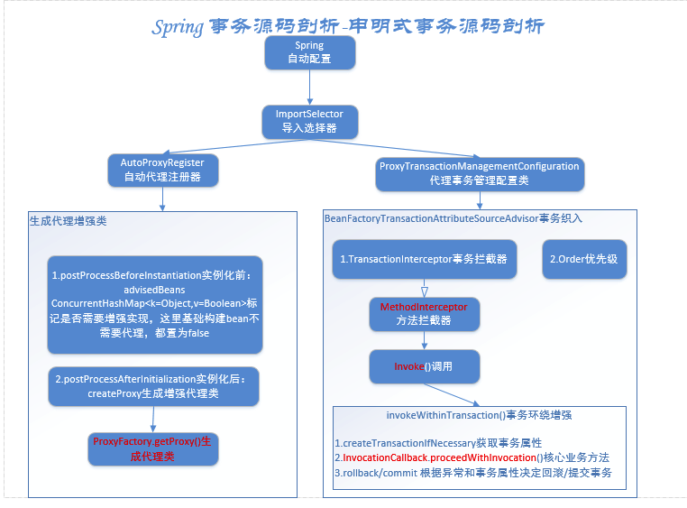
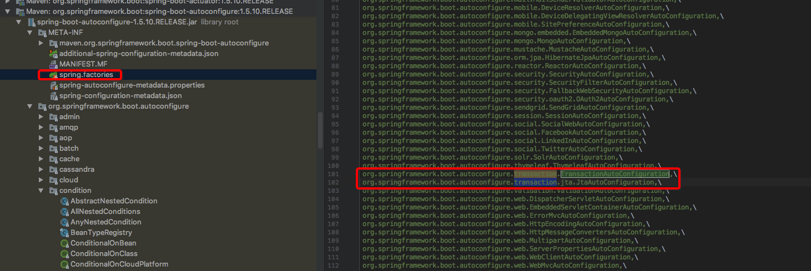

## Spring 源码之事物核心源码

- [spring 事物详解原文](https://www.cnblogs.com/dennyzhangdd/p/9602673.html#_label3_0)

### 在Spring中，事务有两种实现方式：

- 编程式事务管理： 编程式事务管理使用TransactionTemplate可实现更细粒度的事务控制。
- 申明式事务管理： 基于Spring AOP实现。其本质是对方法前后进行拦截，然后在目标方法开始之前创建或者加入一个事务，在执行完目标方法之后根据执行情况提交或者回滚事务。
申明式事务管理不需要入侵代码，通过@Transactional就可以进行事务操作，更快捷而且简单（尤其是配合spring boot自动配置，可以说是精简至极！），且大部分业务都可以满足，推荐使用。
  

### 事务源码

### 2.1 编程式事务TransactionTemplate

- 编程式事务，Spring已经给我们提供好了模板类TransactionTemplate，可以很方便的使用，如下图：


- TransactionTemplate全路径名是：org.springframework.transaction.support.TransactionTemplate。看包名也知道了这是spring对事务的模板类。（...），看下类图先：


````java
public interface TransactionOperations {

    /**
     * Execute the action specified by the given callback object within a transaction.
     * <p>Allows for returning a result object created within the transaction, that is,
     * a domain object or a collection of domain objects. A RuntimeException thrown
     * by the callback is treated as a fatal exception that enforces a rollback.
     * Such an exception gets propagated to the caller of the template.
     * @param action the callback object that specifies the transactional action
     * @return a result object returned by the callback, or {@code null} if none
     * @throws TransactionException in case of initialization, rollback, or system errors
     * @throws RuntimeException if thrown by the TransactionCallback
     */
    <T> T execute(TransactionCallback<T> action) throws TransactionException;

}

public interface InitializingBean {

    /**
     * Invoked by a BeanFactory after it has set all bean properties supplied
     * (and satisfied BeanFactoryAware and ApplicationContextAware).
     * <p>This method allows the bean instance to perform initialization only
     * possible when all bean properties have been set and to throw an
     * exception in the event of misconfiguration.
     * @throws Exception in the event of misconfiguration (such
     * as failure to set an essential property) or if initialization fails.
     */
    void afterPropertiesSet() throws Exception;

}

````
如上图，TransactionOperations这个接口用来执行事务的回调方法，InitializingBean这个是典型的spring bean初始化流程中的预留接口，专用用来在bean属性加载完毕时执行的方法。

- TransactionTemplate的2个接口的impl方法做了什么？

````java
@Override
    public void afterPropertiesSet() {
        if (this.transactionManager == null) {
            throw new IllegalArgumentException("Property 'transactionManager' is required");
        }
    }


    @Override
    public <T> T execute(TransactionCallback<T> action) throws TransactionException {　　　　　　　// 内部封装好的事务管理器
        if (this.transactionManager instanceof CallbackPreferringPlatformTransactionManager) {
            return ((CallbackPreferringPlatformTransactionManager) this.transactionManager).execute(this, action);
        }// 需要手动获取事务，执行方法，提交事务的管理器
        else {// 1.获取事务状态
            TransactionStatus status = this.transactionManager.getTransaction(this);
            T result;
            try {// 2.执行业务逻辑
                result = action.doInTransaction(status);
            }
            catch (RuntimeException ex) {
                // 应用运行时异常 -> 回滚
                rollbackOnException(status, ex);
                throw ex;
            }
            catch (Error err) {
                // Error异常 -> 回滚
                rollbackOnException(status, err);
                throw err;
            }
            catch (Throwable ex) {
                // 未知异常 -> 回滚
                rollbackOnException(status, ex);
                throw new UndeclaredThrowableException(ex, "TransactionCallback threw undeclared checked exception");
            }// 3.事务提交
            this.transactionManager.commit(status);
            return result;
        }
    }

````

- 如上图所示，实际上afterPropertiesSet只是校验了事务管理器不为空，execute()才是核心方法，execute主要步骤：

  - getTransaction()获取事务，源码见3.3.1
  - doInTransaction()执行业务逻辑，这里就是用户自定义的业务代码。如果是没有返回值的，就是doInTransactionWithoutResult()。
  - commit()事务提交：调用AbstractPlatformTransactionManager的commit，rollbackOnException()异常回滚：调用AbstractPlatformTransactionManager的rollback()，事务提交回滚，源码见3.3.3
    
### 申明式事务@Transactional

#### AOP相关概念

申明式事务使用的是spring AOP，即面向切面编程。（什么❓你不知道什么是AOP...一句话概括就是：把业务代码中重复代码做成一个切面，提取出来，并定义哪些方法需要执行这个切面。其它的自行百度吧...）AOP核心概念如下：

- 通知（Advice）:定义了切面(各处业务代码中都需要的逻辑提炼成的一个切面)做什么what+when何时使用。例如：前置通知Before、后置通知After、返回通知After-returning、异常通知After-throwing、环绕通知Around.
- 连接点（Joint point）：程序执行过程中能够插入切面的点，一般有多个。比如调用方式时、抛出异常时。
- 切点（Pointcut）:切点定义了连接点，切点包含多个连接点,即where哪里使用通知.通常指定类+方法 或者 正则表达式来匹配 类和方法名称。
- 切面（Aspect）:切面=通知+切点，即when+where+what何时何地做什么。
- 引入（Introduction）:允许我们向现有的类添加新方法或属性。
- 织入（Weaving）:织入是把切面应用到目标对象并创建新的代理对象的过程。

#### 申明式事务

申明式事务整体调用过程，可以抽出2条线：

- 使用代理模式，生成代理增强类。

- 根据代理事务管理配置类，配置事务的织入，在业务方法前后进行环绕增强，增加一些事务的相关操作。例如获取事务属性、提交事务、回滚事务。

过程如下：



- 申明式事务使用@Transactional这种注解的方式，那么我们就从springboot 容器启动时的自动配置载入（spring boot容器启动详解）开始看。在/META-INF/spring.factories中配置文件中查找，如下图：



载入2个关于事务的自动配置类： 

- org.springframework.boot.autoconfigure.transaction.TransactionAutoConfiguration,
- org.springframework.boot.autoconfigure.transaction.jta.JtaAutoConfiguration,

### TransactionAutoConfiguration自动配置类

````java
@Configuration
@ConditionalOnClass(PlatformTransactionManager.class)
@AutoConfigureAfter({ JtaAutoConfiguration.class, HibernateJpaAutoConfiguration.class,
        DataSourceTransactionManagerAutoConfiguration.class,
        Neo4jDataAutoConfiguration.class })
@EnableConfigurationProperties(TransactionProperties.class)
public class TransactionAutoConfiguration {

    @Bean
    @ConditionalOnMissingBean
    public TransactionManagerCustomizers platformTransactionManagerCustomizers(
            ObjectProvider<List<PlatformTransactionManagerCustomizer<?>>> customizers) {
        return new TransactionManagerCustomizers(customizers.getIfAvailable());
    }

    @Configuration
    @ConditionalOnSingleCandidate(PlatformTransactionManager.class)
    public static class TransactionTemplateConfiguration {

        private final PlatformTransactionManager transactionManager;

        public TransactionTemplateConfiguration(
                PlatformTransactionManager transactionManager) {
            this.transactionManager = transactionManager;
        }

        @Bean
        @ConditionalOnMissingBean
        public TransactionTemplate transactionTemplate() {
            return new TransactionTemplate(this.transactionManager);
        }
    }

    @Configuration
    @ConditionalOnBean(PlatformTransactionManager.class)
    @ConditionalOnMissingBean(AbstractTransactionManagementConfiguration.class)
    public static class EnableTransactionManagementConfiguration {

        @Configuration
        @EnableTransactionManagement(proxyTargetClass = false)
        @ConditionalOnProperty(prefix = "spring.aop", name = "proxy-target-class", havingValue = "false", matchIfMissing = false)
        public static class JdkDynamicAutoProxyConfiguration {

        }

        @Configuration
        @EnableTransactionManagement(proxyTargetClass = true)
        @ConditionalOnProperty(prefix = "spring.aop", name = "proxy-target-class", havingValue = "true", matchIfMissing = true)
        public static class CglibAutoProxyConfiguration {

        }

    }

}


````
#### 2个类注解

- @ConditionalOnClass(PlatformTransactionManager.class)即类路径下包含PlatformTransactionManager这个类时这个自动配置生效，这个类是spring事务的核心包，肯定引入了。

- @AutoConfigureAfter({ JtaAutoConfiguration.class, HibernateJpaAutoConfiguration.class, DataSourceTransactionManagerAutoConfiguration.class, Neo4jDataAutoConfiguration.class })，这个配置在括号中的4个配置类后才生效。

#### 2个内部类

- TransactionTemplateConfiguration事务模板配置类：

  - @ConditionalOnSingleCandidate(PlatformTransactionManager.class)当能够唯一确定一个PlatformTransactionManager bean时才生效。

  - @ConditionalOnMissingBean如果没有定义TransactionTemplate bean生成一个。
  

- EnableTransactionManagementConfiguration开启事务管理器配置类：

  - @ConditionalOnBean(PlatformTransactionManager.class)当存在PlatformTransactionManager bean时生效。

  - @ConditionalOnMissingBean(AbstractTransactionManagementConfiguration.class)当没有自定义抽象事务管理器配置类时才生效。（即用户自定义抽象事务管理器配置类会优先，如果没有，就用这个默认事务管理器配置类）

##### EnableTransactionManagementConfiguration支持2种代理方式：

- 1.JdkDynamicAutoProxyConfiguration：
@EnableTransactionManagement(proxyTargetClass = false)，即proxyTargetClass = false表示是JDK动态代理支持的是：面向接口代理。

@ConditionalOnProperty(prefix = "spring.aop", name = "proxy-target-class", havingValue = "false", matchIfMissing = false)，即spring.aop.proxy-target-class=false时生效，且没有这个配置不生效。


- 2.CglibAutoProxyConfiguration：
@EnableTransactionManagement(proxyTargetClass = true)，即proxyTargetClass = true标识Cglib代理支持的是子类继承代理。
@ConditionalOnProperty(prefix = "spring.aop", name = "proxy-target-class", havingValue = "true", matchIfMissing = true)，即spring.aop.proxy-target-class=true时生效，且没有这个配置默认生效。

**注意了，默认没有配置，走的Cglib代理。说明@Transactional注解支持直接加在类上。**

#### @EnableTransactionManagement注解

````java
@Target(ElementType.TYPE)
@Retention(RetentionPolicy.RUNTIME)
@Documented
@Import(TransactionManagementConfigurationSelector.class)
public @interface EnableTransactionManagement {

    //proxyTargetClass = false表示是JDK动态代理支持接口代理。true表示是Cglib代理支持子类继承代理。
    boolean proxyTargetClass() default false;

    //事务通知模式(切面织入方式)，默认代理模式（同一个类中方法互相调用拦截器不会生效），可以选择增强型AspectJ
    AdviceMode mode() default AdviceMode.PROXY;

    //连接点上有多个通知时，排序，默认最低。值越大优先级越低。
    int order() default Ordered.LOWEST_PRECEDENCE;

}
````

重点看类注解@Import(TransactionManagementConfigurationSelector.class)TransactionManagementConfigurationSelector类图如下：


如上图所示，TransactionManagementConfigurationSelector继承自AdviceModeImportSelector实现了ImportSelector接口。

````java
public class TransactionManagementConfigurationSelector extends AdviceModeImportSelector<EnableTransactionManagement> {

    /**
     * {@inheritDoc}
     * @return {@link ProxyTransactionManagementConfiguration} or
     * {@code AspectJTransactionManagementConfiguration} for {@code PROXY} and
     * {@code ASPECTJ} values of {@link EnableTransactionManagement#mode()}, respectively
     */
    @Override
    protected String[] selectImports(AdviceMode adviceMode) {
        switch (adviceMode) {
            case PROXY:
                return new String[] {AutoProxyRegistrar.class.getName(), ProxyTransactionManagementConfiguration.class.getName()};
            case ASPECTJ:
                return new String[] {TransactionManagementConfigUtils.TRANSACTION_ASPECT_CONFIGURATION_CLASS_NAME};
            default:
                return null;
        }
    }

}
````
如上图，最终会执行selectImports方法导入需要加载的类，我们只看proxy模式下，载入了AutoProxyRegistrar、ProxyTransactionManagementConfiguration2个类。

- **AutoProxyRegistrar**
  给容器中注册一个 InfrastructureAdvisorAutoProxyCreator 组件；利用后置处理器机制在对象创建以后，包装对象，返回一个代理对象（增强器），代理对象执行方法利用拦截器链进行调用；
  
- **ProxyTransactionManagementConfiguration**：就是一个配置类，定义了事务增强器。

### AutoProxyRegistrar

````java
public void registerBeanDefinitions(AnnotationMetadata importingClassMetadata, BeanDefinitionRegistry registry) {
        boolean candidateFound = false;
        Set<String> annoTypes = importingClassMetadata.getAnnotationTypes();
        for (String annoType : annoTypes) {
            AnnotationAttributes candidate = AnnotationConfigUtils.attributesFor(importingClassMetadata, annoType);
            if (candidate == null) {
                continue;
            }
            Object mode = candidate.get("mode");
            Object proxyTargetClass = candidate.get("proxyTargetClass");
            if (mode != null && proxyTargetClass != null && AdviceMode.class == mode.getClass() &&
                    Boolean.class == proxyTargetClass.getClass()) {
                candidateFound = true;
                if (mode == AdviceMode.PROXY) {//代理模式
                    AopConfigUtils.registerAutoProxyCreatorIfNecessary(registry);
                    if ((Boolean) proxyTargetClass) {//如果是CGLOB子类代理模式
                        AopConfigUtils.forceAutoProxyCreatorToUseClassProxying(registry);
                        return;
                    }
                }
            }
        }
        if (!candidateFound) {
            String name = getClass().getSimpleName();
            logger.warn(String.format("%s was imported but no annotations were found " +
                    "having both 'mode' and 'proxyTargetClass' attributes of type " +
                    "AdviceMode and boolean respectively. This means that auto proxy " +
                    "creator registration and configuration may not have occurred as " +
                    "intended, and components may not be proxied as expected. Check to " +
                    "ensure that %s has been @Import'ed on the same class where these " +
                    "annotations are declared; otherwise remove the import of %s " +
                    "altogether.", name, name, name));
        }
    }
````

代理模式：AopConfigUtils.registerAutoProxyCreatorIfNecessary(registry);

最终调用的是：registerOrEscalateApcAsRequired(InfrastructureAdvisorAutoProxyCreator.class, registry, source);基础构建增强自动代理构造器

````java
private static BeanDefinition registerOrEscalateApcAsRequired(Class<?> cls, BeanDefinitionRegistry registry, Object source) {
        Assert.notNull(registry, "BeanDefinitionRegistry must not be null");　　　　　　 //如果当前注册器包含internalAutoProxyCreator
        if (registry.containsBeanDefinition(AUTO_PROXY_CREATOR_BEAN_NAME)) {//org.springframework.aop.config.internalAutoProxyCreator内部自动代理构造器
            BeanDefinition apcDefinition = registry.getBeanDefinition(AUTO_PROXY_CREATOR_BEAN_NAME);
            if (!cls.getName().equals(apcDefinition.getBeanClassName())) {//如果当前类不是internalAutoProxyCreator
                int currentPriority = findPriorityForClass(apcDefinition.getBeanClassName());
                int requiredPriority = findPriorityForClass(cls);
                if (currentPriority < requiredPriority) {//如果下标大于已存在的内部自动代理构造器，index越小，优先级越高,InfrastructureAdvisorAutoProxyCreator index=0,requiredPriority最小，不进入
                    apcDefinition.setBeanClassName(cls.getName());
                }
            }
            return null;//直接返回
        }//如果当前注册器不包含internalAutoProxyCreator，则把当前类作为根定义
        RootBeanDefinition beanDefinition = new RootBeanDefinition(cls);
        beanDefinition.setSource(source);
        beanDefinition.getPropertyValues().add("order", Ordered.HIGHEST_PRECEDENCE);//优先级最高
        beanDefinition.setRole(BeanDefinition.ROLE_INFRASTRUCTURE);
        registry.registerBeanDefinition(AUTO_PROXY_CREATOR_BEAN_NAME, beanDefinition);
        return beanDefinition;
    }
````

如上图，APC_PRIORITY_LIST列表如下图：

````java
/**
     * Stores the auto proxy creator classes in escalation order.
     */
    private static final List<Class<?>> APC_PRIORITY_LIST = new ArrayList<Class<?>>();

    /**
     * 优先级上升list
     */
    static {
        APC_PRIORITY_LIST.add(InfrastructureAdvisorAutoProxyCreator.class);
        APC_PRIORITY_LIST.add(AspectJAwareAdvisorAutoProxyCreator.class);
        APC_PRIORITY_LIST.add(AnnotationAwareAspectJAutoProxyCreator.class);
    }
````

如上图，由于InfrastructureAdvisorAutoProxyCreator这个类在list中第一个index=0,requiredPriority最小，不进入，所以没有重置beanClassName，啥都没做，返回null.

那么增强代理类何时生成呢？

InfrastructureAdvisorAutoProxyCreator类图如下：


如上图所示，看2个核心方法：InstantiationAwareBeanPostProcessor接口的postProcessBeforeInstantiation实例化前+BeanPostProcessor接口的postProcessAfterInitialization初始化后

````java

1     @Override
 2     public Object postProcessBeforeInstantiation(Class<?> beanClass, String beanName) throws BeansException {
        3         Object cacheKey = getCacheKey(beanClass, beanName);
        4
        5         if (beanName == null || !this.targetSourcedBeans.contains(beanName)) {
        6             if (this.advisedBeans.containsKey(cacheKey)) {//如果已经存在直接返回
        7                 return null;
        8             }//是否基础构件（基础构建不需要代理）：Advice、Pointcut、Advisor、AopInfrastructureBean这四类都算基础构建
        9             if (isInfrastructureClass(beanClass) || shouldSkip(beanClass, beanName)) {
        10                 this.advisedBeans.put(cacheKey, Boolean.FALSE);//添加进advisedBeans ConcurrentHashMap<k=Object,v=Boolean>标记是否需要增强实现，这里基础构建bean不需要代理，都置为false，供后面postProcessAfterInitialization实例化后使用。
        11                 return null;
        12             }
        13         }
        14
        15         // TargetSource是spring aop预留给我们用户自定义实例化的接口，如果存在TargetSource就不会默认实例化，而是按照用户自定义的方式实例化，咱们没有定义，不进入
        18         if (beanName != null) {
        19             TargetSource targetSource = getCustomTargetSource(beanClass, beanName);
        20             if (targetSource != null) {
        21                 this.targetSourcedBeans.add(beanName);
        22                 Object[] specificInterceptors = getAdvicesAndAdvisorsForBean(beanClass, beanName, targetSource);
        23                 Object proxy = createProxy(beanClass, beanName, specificInterceptors, targetSource);
        24                 this.proxyTypes.put(cacheKey, proxy.getClass());
        25                 return proxy;
        26             }
        27         }
        28
        29         return null;
        30     }
````

通过追踪，由于InfrastructureAdvisorAutoProxyCreator是基础构建类，advisedBeans.put(cacheKey, Boolean.FALSE)

添加进advisedBeans ConcurrentHashMap<k=Object,v=Boolean>标记是否需要增强实现，这里基础构建bean不需要代理，都置为false，供后面postProcessAfterInitialization实例化后使用。

postProcessAfterInitialization源码如下：

````java
@Override
    public Object postProcessAfterInitialization(Object bean, String beanName) throws BeansException {
        if (bean != null) {
            Object cacheKey = getCacheKey(bean.getClass(), beanName);
            if (!this.earlyProxyReferences.contains(cacheKey)) {
                return wrapIfNecessary(bean, beanName, cacheKey);
            }
        }
        return bean;
    }

    protected Object wrapIfNecessary(Object bean, String beanName, Object cacheKey) {　　　　　　 // 如果是用户自定义获取实例，不需要增强处理，直接返回
        if (beanName != null && this.targetSourcedBeans.contains(beanName)) {
            return bean;
        }// 查询map缓存，标记过false,不需要增强直接返回
        if (Boolean.FALSE.equals(this.advisedBeans.get(cacheKey))) {
            return bean;
        }// 判断一遍springAOP基础构建类，标记过false,不需要增强直接返回
        if (isInfrastructureClass(bean.getClass()) || shouldSkip(bean.getClass(), beanName)) {
            this.advisedBeans.put(cacheKey, Boolean.FALSE);
            return bean;
        }

        // 获取增强List<Advisor> advisors
        Object[] specificInterceptors = getAdvicesAndAdvisorsForBean(bean.getClass(), beanName, null);　　　　　　 // 如果存在增强
        if (specificInterceptors != DO_NOT_PROXY) {
            this.advisedBeans.put(cacheKey, Boolean.TRUE);// 标记增强为TRUE,表示需要增强实现　　　　　　　　  // 生成增强代理类
            Object proxy = createProxy(
                    bean.getClass(), beanName, specificInterceptors, new SingletonTargetSource(bean));
            this.proxyTypes.put(cacheKey, proxy.getClass());
            return proxy;
        }
　　　　 // 如果不存在增强，标记false,作为缓存，再次进入提高效率，第16行利用缓存先校验
        this.advisedBeans.put(cacheKey, Boolean.FALSE);
        return bean;
    }

````
下面看核心方法createProxy如下：

````java

protected Object createProxy(
            Class<?> beanClass, String beanName, Object[] specificInterceptors, TargetSource targetSource) {
　　　　 // 如果是ConfigurableListableBeanFactory接口（咱们DefaultListableBeanFactory就是该接口的实现类）则，暴露目标类
        if (this.beanFactory instanceof ConfigurableListableBeanFactory) {　　　　　　　　  //给beanFactory->beanDefinition定义一个属性：k=AutoProxyUtils.originalTargetClass,v=需要被代理的bean class
            AutoProxyUtils.exposeTargetClass((ConfigurableListableBeanFactory) this.beanFactory, beanName, beanClass);
        }

        ProxyFactory proxyFactory = new ProxyFactory();
        proxyFactory.copyFrom(this);
　　　　 //如果不是代理目标类
        if (!proxyFactory.isProxyTargetClass()) {//如果beanFactory定义了代理目标类（CGLIB）
            if (shouldProxyTargetClass(beanClass, beanName)) {
                proxyFactory.setProxyTargetClass(true);//代理工厂设置代理目标类
            }
            else {//否则设置代理接口（JDK）
                evaluateProxyInterfaces(beanClass, proxyFactory);
            }
        }
　　　　 //把拦截器包装成增强（通知）
        Advisor[] advisors = buildAdvisors(beanName, specificInterceptors);
        proxyFactory.addAdvisors(advisors);//设置进代理工厂
        proxyFactory.setTargetSource(targetSource);
        customizeProxyFactory(proxyFactory);//空方法，留给子类拓展用，典型的spring的风格，喜欢处处留后路
　　　　 //用于控制代理工厂是否还允许再次添加通知，默认为false（表示不允许）
        proxyFactory.setFrozen(this.freezeProxy);
        if (advisorsPreFiltered()) {//默认false，上面已经前置过滤了匹配的增强Advisor
            proxyFactory.setPreFiltered(true);
        }
        //代理工厂获取代理对象的核心方法
        return proxyFactory.getProxy(getProxyClassLoader());
    }


````

最终我们生成的是CGLIB代理类.到此为止我们分析完了代理类的构造过程。

-----
### ProxyTransactionManagementConfiguration
下面来看ProxyTransactionManagementConfiguration：

````java
@Configuration
public class ProxyTransactionManagementConfiguration extends AbstractTransactionManagementConfiguration {

    @Bean(name = TransactionManagementConfigUtils.TRANSACTION_ADVISOR_BEAN_NAME)
    @Role(BeanDefinition.ROLE_INFRASTRUCTURE)//定义事务增强器
    public BeanFactoryTransactionAttributeSourceAdvisor transactionAdvisor() {
        BeanFactoryTransactionAttributeSourceAdvisor j = new BeanFactoryTransactionAttributeSourceAdvisor();
        advisor.setTransactionAttributeSource(transactionAttributeSource());
        advisor.setAdvice(transactionInterceptor());
        advisor.setOrder(this.enableTx.<Integer>getNumber("order"));
        return advisor;
    }

    @Bean
    @Role(BeanDefinition.ROLE_INFRASTRUCTURE)//定义基于注解的事务属性资源
    public TransactionAttributeSource transactionAttributeSource() {
        return new AnnotationTransactionAttributeSource();
    }

    @Bean
    @Role(BeanDefinition.ROLE_INFRASTRUCTURE)//定义事务拦截器
    public TransactionInterceptor transactionInterceptor() {
        TransactionInterceptor interceptor = new TransactionInterceptor();
        interceptor.setTransactionAttributeSource(transactionAttributeSource());
        if (this.txManager != null) {
            interceptor.setTransactionManager(this.txManager);
        }
        return interceptor;
    }

}

````

核心方法：transactionAdvisor()事务织入

定义了一个advisor，设置事务属性、设置事务拦截器TransactionInterceptor、设置顺序。核心就是事务拦截器TransactionInterceptor。

TransactionInterceptor使用通用的spring事务基础架构实现“声明式事务”，继承自TransactionAspectSupport类（该类包含与Spring的底层事务API的集成），实现了MethodInterceptor接口。spring类图如下：


事务拦截器的拦截功能就是依靠实现了MethodInterceptor接口，熟悉spring的同学肯定很熟悉MethodInterceptor了，这个是spring的方法拦截器，主要看invoke方法：

````java
@Override
    public Object invoke(final MethodInvocation invocation) throws Throwable {
        // Work out the target class: may be {@code null}.
        // The TransactionAttributeSource should be passed the target class
        // as well as the method, which may be from an interface.
        Class<?> targetClass = (invocation.getThis() != null ? AopUtils.getTargetClass(invocation.getThis()) : null);

        // 调用TransactionAspectSupport的 invokeWithinTransaction方法
        return invokeWithinTransaction(invocation.getMethod(), targetClass, new InvocationCallback() {
            @Override
            public Object proceedWithInvocation() throws Throwable {
                return invocation.proceed();
            }
        });
    }
````

如上图TransactionInterceptor复写MethodInterceptor接口的invoke方法，并在invoke方法中调用了父类TransactionAspectSupport的invokeWithinTransaction()方法，源码如下：

````java
protected Object invokeWithinTransaction(Method method, Class<?> targetClass, final InvocationCallback invocation)
            throws Throwable {

        // 如果transaction attribute为空,该方法就是非事务（非编程式事务）
        final TransactionAttribute txAttr = getTransactionAttributeSource().getTransactionAttribute(method, targetClass);
        final PlatformTransactionManager tm = determineTransactionManager(txAttr);
        final String joinpointIdentification = methodIdentification(method, targetClass, txAttr);
　　　　 // 标准声明式事务：如果事务属性为空 或者 非回调偏向的事务管理器
        if (txAttr == null || !(tm instanceof CallbackPreferringPlatformTransactionManager)) {
            // Standard transaction demarcation with getTransaction and commit/rollback calls.
            TransactionInfo txInfo = createTransactionIfNecessary(tm, txAttr, joinpointIdentification);
            Object retVal = null;
            try {
                // 这里就是一个环绕增强，在这个proceed前后可以自己定义增强实现
                // 方法执行
                retVal = invocation.proceedWithInvocation();
            }
            catch (Throwable ex) {
                // 根据事务定义的，该异常需要回滚就回滚，否则提交事务
                completeTransactionAfterThrowing(txInfo, ex);
                throw ex;
            }
            finally {//清空当前事务信息，重置为老的
                cleanupTransactionInfo(txInfo);
            }//返回结果之前提交事务
            commitTransactionAfterReturning(txInfo);
            return retVal;
        }
　　　　 // 编程式事务：（回调偏向）
        else {
            final ThrowableHolder throwableHolder = new ThrowableHolder();

            // It's a CallbackPreferringPlatformTransactionManager: pass a TransactionCallback in.
            try {
                Object result = ((CallbackPreferringPlatformTransactionManager) tm).execute(txAttr,
                        new TransactionCallback<Object>() {
                            @Override
                            public Object doInTransaction(TransactionStatus status) {
                                TransactionInfo txInfo = prepareTransactionInfo(tm, txAttr, joinpointIdentification, status);
                                try {
                                    return invocation.proceedWithInvocation();
                                }
                                catch (Throwable ex) {// 如果该异常需要回滚
                                    if (txAttr.rollbackOn(ex)) {
                                        // 如果是运行时异常返回
                                        if (ex instanceof RuntimeException) {
                                            throw (RuntimeException) ex;
                                        }// 如果是其它异常都抛ThrowableHolderException
                                        else {
                                            throw new ThrowableHolderException(ex);
                                        }
                                    }// 如果不需要回滚
                                    else {
                                        // 定义异常，最终就直接提交事务了
                                        throwableHolder.throwable = ex;
                                        return null;
                                    }
                                }
                                finally {//清空当前事务信息，重置为老的
                                    cleanupTransactionInfo(txInfo);
                                }
                            }
                        });

                // 上抛异常
                if (throwableHolder.throwable != null) {
                    throw throwableHolder.throwable;
                }
                return result;
            }
            catch (ThrowableHolderException ex) {
                throw ex.getCause();
            }
            catch (TransactionSystemException ex2) {
                if (throwableHolder.throwable != null) {
                    logger.error("Application exception overridden by commit exception", throwableHolder.throwable);
                    ex2.initApplicationException(throwableHolder.throwable);
                }
                throw ex2;
            }
            catch (Throwable ex2) {
                if (throwableHolder.throwable != null) {
                    logger.error("Application exception overridden by commit exception", throwableHolder.throwable);
                }
                throw ex2;
            }
        }
    }
````

如上图，我们主要看第一个分支，申明式事务，核心流程如下：

- createTransactionIfNecessary():如果有必要，创建事务

- InvocationCallback的proceedWithInvocation()：InvocationCallback是父类的内部回调接口，子类中实现该接口供父类调用，子类TransactionInterceptor中invocation.proceed()。回调方法执行

- 异常回滚completeTransactionAfterThrowing()

#### 1.createTransactionIfNecessary()

````java
protected TransactionInfo createTransactionIfNecessary(
            PlatformTransactionManager tm, TransactionAttribute txAttr, final String joinpointIdentification) {

        // 如果还没有定义名字，把连接点的ID定义成事务的名称
        if (txAttr != null && txAttr.getName() == null) {
            txAttr = new DelegatingTransactionAttribute(txAttr) {
                @Override
                public String getName() {
                    return joinpointIdentification;
                }
            };
        }

        TransactionStatus status = null;
        if (txAttr != null) {
            if (tm != null) {
                status = tm.getTransaction(txAttr);
            }
            else {
                if (logger.isDebugEnabled()) {
                    logger.debug("Skipping transactional joinpoint [" + joinpointIdentification +
                            "] because no transaction manager has been configured");
                }
            }
        }
        return prepareTransactionInfo(tm, txAttr, joinpointIdentification, status);
    }

````
核心就是：

- getTransaction()，根据事务属性获取事务TransactionStatus，大道归一，都是调用PlatformTransactionManager.getTransaction()，源码见3.3.1。
- prepareTransactionInfo(),构造一个TransactionInfo事务信息对象，绑定当前线程：ThreadLocal<TransactionInfo>。

#### 2.invocation.proceed()回调业务方法:


如上图，ReflectiveMethodInvocation类实现了ProxyMethodInvocation接口，但是ProxyMethodInvocation继承了3层接口...ProxyMethodInvocation->MethodInvocation->Invocation->Joinpoint

- Joinpoint：连接点接口，定义了执行接口：Object proceed() throws Throwable; 执行当前连接点，并跳到拦截器链上的下一个拦截器。

- Invocation：调用接口，继承自Joinpoint，定义了获取参数接口： Object[] getArguments();是一个带参数的、可被拦截器拦截的连接点。

- MethodInvocation：方法调用接口，继承自Invocation，定义了获取方法接口：Method getMethod(); 是一个带参数的可被拦截的连接点方法。

- ProxyMethodInvocation：代理方法调用接口，继承自MethodInvocation，定义了获取代理对象接口：Object getProxy();是一个由代理类执行的方法调用连接点方法。

- ReflectiveMethodInvocation：实现了ProxyMethodInvocation接口，自然就实现了父类接口的的所有接口。获取代理类，获取方法，获取参数，用代理类执行这个方法并且自动跳到下一个连接点。

下面看一下proceed方法源码：

````java
1 @Override
 2     public Object proceed() throws Throwable {
 3         //    启动时索引为-1，唤醒连接点，后续递增
 4         if (this.currentInterceptorIndex == this.interceptorsAndDynamicMethodMatchers.size() - 1) {
 5             return invokeJoinpoint();
 6         }
 7 
 8         Object interceptorOrInterceptionAdvice =
 9                 this.interceptorsAndDynamicMethodMatchers.get(++this.currentInterceptorIndex);
10         if (interceptorOrInterceptionAdvice instanceof InterceptorAndDynamicMethodMatcher) {
11             // 这里进行动态方法匹配校验，静态的方法匹配早已经校验过了（MethodMatcher接口有两种典型：动态/静态校验）
13             InterceptorAndDynamicMethodMatcher dm =
14                     (InterceptorAndDynamicMethodMatcher) interceptorOrInterceptionAdvice;
15             if (dm.methodMatcher.matches(this.method, this.targetClass, this.arguments)) {
16                 return dm.interceptor.invoke(this);
17             }
18             else {
19                 // 动态匹配失败，跳过当前拦截，进入下一个（拦截器链）
21                 return proceed();
22             }
23         }
24         else {
25             // 它是一个拦截器，所以我们只调用它:在构造这个对象之前，切入点将被静态地计算。
27             return ((MethodInterceptor) interceptorOrInterceptionAdvice).invoke(this);
28         }
29     }

````

咱们这里最终调用的是((MethodInterceptor) interceptorOrInterceptionAdvice).invoke(this);就是TransactionInterceptor事务拦截器回调 目标业务方法（addUserBalanceAndUser）。

### 3.completeTransactionAfterThrowing()

最终调用AbstractPlatformTransactionManager的rollback()，提交事务commitTransactionAfterReturning()最终调用AbstractPlatformTransactionManager的commit(),源码见3.3.3

---

## 事务核心源码


