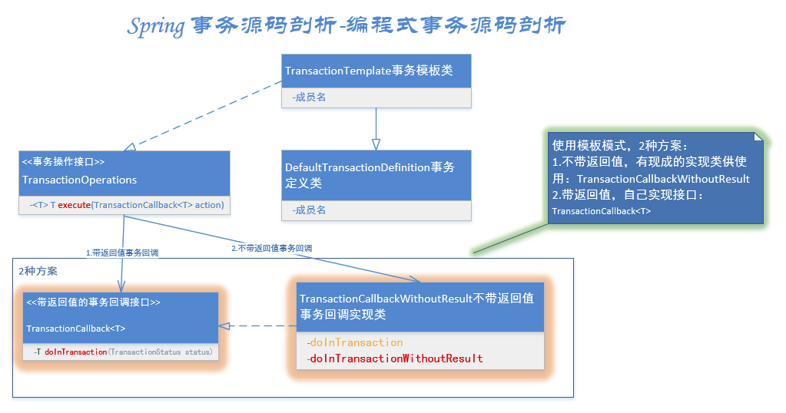
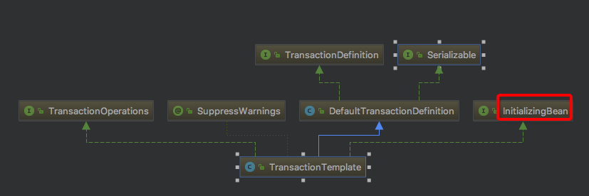

## Spring 源码之事物核心源码

- [spring 事物详解原文](https://www.cnblogs.com/dennyzhangdd/p/9602673.html#_label3_0)

### 在Spring中，事务有两种实现方式：

- 编程式事务管理： 编程式事务管理使用TransactionTemplate可实现更细粒度的事务控制。
- 申明式事务管理： 基于Spring AOP实现。其本质是对方法前后进行拦截，然后在目标方法开始之前创建或者加入一个事务，在执行完目标方法之后根据执行情况提交或者回滚事务。
申明式事务管理不需要入侵代码，通过@Transactional就可以进行事务操作，更快捷而且简单（尤其是配合spring boot自动配置，可以说是精简至极！），且大部分业务都可以满足，推荐使用。
  

### 事务源码

### 2.1 编程式事务TransactionTemplate

- 编程式事务，Spring已经给我们提供好了模板类TransactionTemplate，可以很方便的使用，如下图：



- TransactionTemplate全路径名是：org.springframework.transaction.support.TransactionTemplate。看包名也知道了这是spring对事务的模板类。（...），看下类图先：



````java
public interface TransactionOperations {

    /**
     * Execute the action specified by the given callback object within a transaction.
     * <p>Allows for returning a result object created within the transaction, that is,
     * a domain object or a collection of domain objects. A RuntimeException thrown
     * by the callback is treated as a fatal exception that enforces a rollback.
     * Such an exception gets propagated to the caller of the template.
     * @param action the callback object that specifies the transactional action
     * @return a result object returned by the callback, or {@code null} if none
     * @throws TransactionException in case of initialization, rollback, or system errors
     * @throws RuntimeException if thrown by the TransactionCallback
     */
    <T> T execute(TransactionCallback<T> action) throws TransactionException;

}

public interface InitializingBean {

    /**
     * Invoked by a BeanFactory after it has set all bean properties supplied
     * (and satisfied BeanFactoryAware and ApplicationContextAware).
     * <p>This method allows the bean instance to perform initialization only
     * possible when all bean properties have been set and to throw an
     * exception in the event of misconfiguration.
     * @throws Exception in the event of misconfiguration (such
     * as failure to set an essential property) or if initialization fails.
     */
    void afterPropertiesSet() throws Exception;

}

````
如上图，TransactionOperations这个接口用来执行事务的回调方法，InitializingBean这个是典型的spring bean初始化流程中的预留接口，专用用来在bean属性加载完毕时执行的方法。

- TransactionTemplate的2个接口的impl方法做了什么？

````java
@Override
    public void afterPropertiesSet() {
        if (this.transactionManager == null) {
            throw new IllegalArgumentException("Property 'transactionManager' is required");
        }
    }


    @Override
    public <T> T execute(TransactionCallback<T> action) throws TransactionException {　　　　　　　// 内部封装好的事务管理器
        if (this.transactionManager instanceof CallbackPreferringPlatformTransactionManager) {
            return ((CallbackPreferringPlatformTransactionManager) this.transactionManager).execute(this, action);
        }// 需要手动获取事务，执行方法，提交事务的管理器
        else {// 1.获取事务状态
            TransactionStatus status = this.transactionManager.getTransaction(this);
            T result;
            try {// 2.执行业务逻辑
                result = action.doInTransaction(status);
            }
            catch (RuntimeException ex) {
                // 应用运行时异常 -> 回滚
                rollbackOnException(status, ex);
                throw ex;
            }
            catch (Error err) {
                // Error异常 -> 回滚
                rollbackOnException(status, err);
                throw err;
            }
            catch (Throwable ex) {
                // 未知异常 -> 回滚
                rollbackOnException(status, ex);
                throw new UndeclaredThrowableException(ex, "TransactionCallback threw undeclared checked exception");
            }// 3.事务提交
            this.transactionManager.commit(status);
            return result;
        }
    }

````

- 如上图所示，实际上afterPropertiesSet只是校验了事务管理器不为空，execute()才是核心方法，execute主要步骤：

  - getTransaction()获取事务，源码见3.3.1
  - doInTransaction()执行业务逻辑，这里就是用户自定义的业务代码。如果是没有返回值的，就是doInTransactionWithoutResult()。
  - commit()事务提交：调用AbstractPlatformTransactionManager的commit，rollbackOnException()异常回滚：调用AbstractPlatformTransactionManager的rollback()，事务提交回滚，源码见3.3.3
    
### 申明式事务@Transactional

#### AOP相关概念

申明式事务使用的是spring AOP，即面向切面编程。（什么❓你不知道什么是AOP...一句话概括就是：把业务代码中重复代码做成一个切面，提取出来，并定义哪些方法需要执行这个切面。其它的自行百度吧...）AOP核心概念如下：

- 通知（Advice）:定义了切面(各处业务代码中都需要的逻辑提炼成的一个切面)做什么what+when何时使用。例如：前置通知Before、后置通知After、返回通知After-returning、异常通知After-throwing、环绕通知Around.
- 连接点（Joint point）：程序执行过程中能够插入切面的点，一般有多个。比如调用方式时、抛出异常时。
- 切点（Pointcut）:切点定义了连接点，切点包含多个连接点,即where哪里使用通知.通常指定类+方法 或者 正则表达式来匹配 类和方法名称。
- 切面（Aspect）:切面=通知+切点，即when+where+what何时何地做什么。
- 引入（Introduction）:允许我们向现有的类添加新方法或属性。
- 织入（Weaving）:织入是把切面应用到目标对象并创建新的代理对象的过程。

#### 申明式事务

