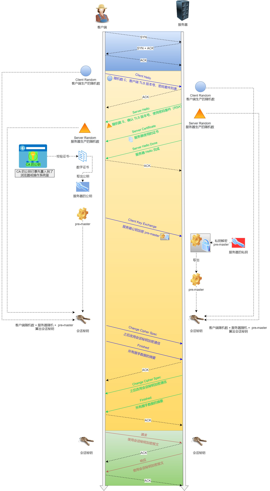

## HTTP 与 HTTPS

### Q1: 什么是 HTTPS？

- HTTPS 是安全的 HTTP
- HTTP 协议中的内容都是明文传输，HTTPS 的目的是将这些内容加密，确保信息传输安全。最后一个字母 S 指的是 SSL/TLS 协议，它位于 HTTP 协议与 TCP/IP 协议中间。

### Q2: 你说的信息传输安全是什么意思(加密+防篡改)

- 客户端和服务器直接的通信只有自己能看懂，即使第三方拿到数据也看不懂这些信息的真实含义。
- 第三方虽然看不懂数据，但可以 XJB 改，因此客户端和服务器必须有能力判断数据是否被修改过。
- 客户端必须避免中间人攻击，即除了真正的服务器，任何第三方都无法冒充服务器。
  很遗憾的是，目前的 HTTP 协议还不满足上述三条要求中的任何一条。

### Q3: 这么多要求，一个一个去满足是不是很累？
- 第三个要求可以不用管
  我们都知道加密需要密码，密码不是天下掉下来，也得需要双方经过通信才能协商出来。所以一个设计良好的加密机制必然会防止第三者的干扰和伪造。等搞明白了加密的具体原理，我们自然可以检验是否满足:“任何第三者无法冒充服务器”这一要求。

### Q4: 那怎么加密信息呢

- 使用对称加密技术
- 对称加密可以理解为对原始数据的可逆变换。比如 Hello 可以变换成 Ifmmp，规则就是每个字母变成它在字母表上的后一个字母，这里的秘钥就是 1，另一方拿到 Ifmmp 就可以还原成原来的信息 Hello 了。

引入对称加密后，HTTPS 的握手流程就会多了两步，用来传递对称加密的秘钥:

````text
客户端: 你好，我需要发起一个 HTTPS 请求
服务器: 好的，你的秘钥是 1。

````
提到了对称加密，那么自然还有非对称加密。它的思想很简单，计算两个质数的乘积很容易，但反过来分解成两个质数的乘积就很难，要经过极为复杂的运算。非对称加密有两个秘钥，一个是公钥，一个是私钥。公钥加密的内容只有私钥可以解密，私钥加密的内容只有公钥可以解密。一般我们把服务器自己留着，不对外公布的密钥称为私钥，所有人都可以获取的称为公钥。

使用对称加密一般要比非对称加密快得多，对服务器的运算压力也小得多。

### Q5: 对称秘钥如何传输

- 服务器直接返回明文的**对称加密密钥**是不是不安全。如果有监听者拿到这个密钥，不就知道客户端和服务器后续的通信内容了么？

- **利用非对称加密** 是这样，所以不能明文传递对称秘钥，而且也不能用一个新的对称加密算法来加密原来的对称秘钥，否则新的对称秘钥同样无法传输，这就是鸡生蛋、蛋生鸡的悖论。

- 这里我们引入**非对称加密的方式**，非对称加密的特性决定了服务器用私钥加密的内容并不是真正的加密，因为公钥所有人都有，所以服务器的密文能被所有人解析。但私钥只掌握在服务器手上，这就带来了两个巨大的优势:

    - **服务器下发的内容不可能被伪造:** 因为别人都没有私钥，所以无法加密。强行加密的后果是客户端用公钥无法解开。
    - **任何人用公钥加密的内容都是绝对安全的:** 因为私钥只有服务器有，也就是只有真正的服务器可以看到被加密的原文。

- 所以传输对称秘钥的问题就迎刃而解了: 秘钥不是由服务器下发，而是由客户端生成并且主动告诉服务器。

所以当引入非对称加密后，HTTPS 的握手流程依然是两步，不过细节略有变化:

````text
客户端: 你好，我需要发起一个 HTTPS 请求，这是我的 (用公钥加密后的) 秘钥。
服务器: 好的，我知道你的秘钥了，后续就用它传输。

````
### Q5: 那公钥怎么传输

- 你好像还是没有解决鸡生蛋，蛋生鸡的问题。你说客户端发送请求时要用公钥加密对称秘钥，那公钥怎么传输呢？

#### BS: 对公钥加密就行了。。。

- 每一个使用 HTTPS 的服务器都必须去专门的证书机构注册一个证书，**证书中存储了用权威机构私钥加密的公钥**。这样客户端用权威机构的公钥解密就可以了。

##### 现在 HTTPS 协议的握手阶段变成了四步:

````text
客户端: 你好，我要发起一个 HTTPS 请求，请给我公钥
服务器: 好的，这是我的证书，里面有加密后的公钥
客户端: 解密成功以后告诉服务器: 这是我的 (用公钥加密后的) 对称秘钥。
服务器: 好的，我知道你的秘钥了，后续就用它传输。

````
### Q6: 你在逗我么。。。。

- 那权威机构的公钥又怎么传输？

#### BS: 存在电脑里

- 这个公钥不用传输，会直接内置在各大操作系统(或者浏览器)的出厂设置里。之所以不把每个服务器的公钥内置在电脑里，一方面是因为服务器太多，存不过来。另一方面操作系统也不信任你，凭什么你说你这个就是百度/淘宝的证书呢？

- 所以各个公司要先去权威机构认证，申请证书，然后操作系统只会存储权威机构的公钥。因为权威机构数量有限，所以操作系统厂商相对来说容易管理。如果这个权威机构不够权威，XJB 发证书，就会取消他的资格，比如可怜的沃通。。。。

### Q7: 怎么知道证书有没有被篡改？

- 你说服务器第一次会返回证书，也就是加密以后的公钥，那我怎么知道这个证书是可靠的？

#### BS: 将信息 hash 值随着信息一起传递

- 我们都知道哈希算法的特点，它可以压缩数据，如果从函数角度来看，不管多复杂的数据(定义域可以非常大)经过哈希算法都会得到一个值，而且这个值处在某个特定(远小于定义域的范围)值域内。相同数据的哈希结果一定相同，不相同数据的哈希结果一般不同，不过也有小概率会重复，这叫哈希冲突。

- 为了确保原始证书没有被篡改，我们可以在传递证书的同时传递证书的哈希值。由于第三者无法解析数据，只能 XJB 改，那么修改后的数据在解密后，就不可能通过哈希。

比如说公钥就是之前的例子 Hello，我们假设哈希算法是获取字符串的最后一个字符，那么 Hello 的哈希值就是 o，所以加密字符串是 Ifmmpp。虽然公钥已知，每个人都可以解密，解密完也可以篡改，但是因为没有私钥， 所以无法正确的加密。所以它再返回给客户端的数据是无效数据，用公钥解析后会得到乱码。即使攻击者通过多次尝试碰巧能够解析，也无法通过哈希校验。

### Q8: 这样可以防止第三方冒充服务器么
#### BS: 也许可以

- 首先真正的服务器下发的内容，无法被别人篡改。他们有权威机构的公钥，所以可以解密，但是因为没有私钥，所以解密以后的信息无法加密。没有加密或者错误加密的信息被客户端用公钥解密以后，必然无法通过哈希校验。

- 但是，如果你一开始请求的就不是真的服务器，而是一个攻击者，此时的他完全有机会进行中间人攻击。我们知道**第一次握手**的时候服务器会下发用于证明自己身份的证书，这个证书会用预设在设备上的公钥来解密。所以要么是经过认证的证书用权威机构的私钥加密，再用权威机构解密，要么是用非权威机构的私钥加密，然后找不到公钥解密。

- 所以如果不小心安装过非权威机构的根证书，比如黑客提供的恶意证书，这时候设备上就多了一个预设的公钥，那么用恶意私钥加密的证书就能被正常解析出来。所以千万不要随便装根证书，这等于是为那些恶意证书留了一扇门。

- 当然，凡是都有两面性。我们知道 Charles 可以调试 HTTPS 通信，它的原理就是需要用户安装 Charles 的根证书，然后我们的请求会被代理到 Charles 服务器，它下发的 Charles 证书才能被正确解析。另一方面，Charles 会作为客户端，从真正的服务器哪里拿到正确的 https 证书并用于后续通信。幸好 Charles 不是流氓软件，或者它的私钥一旦泄露，对用户都会造成很大的影响。

我可以举一个例子，证书有多个种类，最贵的叫 EV (Extended Validation)，它需要公司营业执照等多个文件才能申请人工审核，好处也很明显，可以在浏览器地址栏左侧准确显示公司名称，比如 Bitbucket 的官网:

EV 证书左侧的名字
这是客户端直连时候的正常现象。但如果你用 Charles 代理，客户端拿到的是 Charles 证书，所以会变成:

代理模式下无法显示
### Q9: HTTPS 握手会影响性能么

- TCP 有三次握手，再加上 HTTPS 的四次握手，会不会影响性能？

#### BS: 影响肯定有，但是可以接受

- 首先，HTTPS 肯定会更慢一点，时间主要花费在两组 SSL 之间的耗时和证书的读取验证上，对称算法的加解密时间几乎可以忽略不计。

- 而且如果不是首次握手，后续的请求并不需要完整的握手过程。客户端可以把上次的加密情况直接发送给服务器从而快速恢复，具体细节可以参考 图解SSL/TLS协议。

- 除此以外，SSL 握手的时间并不是只能用来传递加密信息，还可以承担起客户端和服务器沟通 HTTP2 兼容情况的任务。因此从 HTTPS 切换到 HTTP2.0 不会有任何性能上的开销，反倒是得益于 HTTP2.0 的多路复用等技术，后续可以节约大量时间。

如果把 HTTPS2.0 当做目标，那么 HTTPS 的性能损耗就更小了，远远比不上它带来的安全性提升。

---------

## ssl/tls建立链接的过程



### 1. ClientHello

首先，由客户端向服务器发起加密通信请求，也就是 ClientHello 请求。

在这一步，客户端主要向服务器发送以下信息：

（1）客户端支持的 SSL/TLS 协议版本，如 TLS 1.2 版本。

（2）__客户端生产的随机数（Client Random），后面用于生产「会话秘钥」。__

（3）客户端支持的密码套件列表，如 RSA 加密算法。

### 2. SeverHello

服务器收到客户端请求后，向客户端发出响应，也就是 SeverHello。服务器回应的内容有如下内容：

（1）确认 SSL/ TLS 协议版本，如果浏览器不支持，则关闭加密通信。

（2）__服务器生产的随机数（Server Random），后面用于生产「会话秘钥」.__

（3）确认的密码套件列表，如 RSA 加密算法。

（4）__服务器的数字证书。(里面有证书私钥加密的服务器公钥)__

### 3.客户端回应

客户端收到服务器的回应之后，首先通过浏览器或者操作系统中的 CA 公钥，确认服务器的数字证书的真实性。

如果证书没有问题，客户端会从数字证书中取出服务器的公钥，然后使用它加密报文，向服务器发送如下信息：

（1）__一个随机数（pre-master key）。该随机数会被服务器公钥加密。__

（2）加密通信算法改变通知，表示随后的信息都将用「会话秘钥」加密通信。

（3）客户端握手结束通知，表示客户端的握手阶段已经结束。这一项同时把之前所有内容的发生的数据做个摘要，用来供服务端校验。

__上面第一项的随机数是整个握手阶段的第三个随机数，这样服务器和客户端就同时有三个随机数，接着就用双方协商的加密算法，各自生成本次通信的「会话秘钥」。__

### 4. 服务器最后的回应

__服务器收到客户端的第三个随机数（pre-master key）之后，通过协商的加密算法，计算出本次通信的「会话秘钥」。__ 然后，向客户端发生最后的信息：

（1）加密通信算法改变通知，表示随后的信息都将用「会话秘钥」加密通信。

（2）服务器握手结束通知，表示服务器的握手阶段已经结束。这一项同时把之前所有内容的发生的数据做个摘要，用来供客户端校验。

至此，整个 SSL/TLS 的握手阶段全部结束。接下来，客户端与服务器进入加密通信，就完全是使用普通的 HTTP 协议，只不过用「会话秘钥」加密内容。”


